<!-- omit in toc -->
# 波動粒子相互作用解析(WPIA)コード開発メモ

<!-- omit in toc -->
## 概要
本書は、非線形波動粒子相互作用の直接観測を解析するためのコードである Wave–Particle Interaction Analyzer（WPIA）コードの実装方法をまとめたものである。本書の目的は、Shoji et al. (2021)[^1] において示された、Electromagnetic ion cyclotron wave（EMIC）と陽子の間で生じた非線形波動粒子相互作用について、Arase衛星による直接観測結果（Figures 3 and 4）を再現することである。


<!-- omit in toc -->
## 目次
- [I. WPIAの仕組み](#i-wpiaの仕組み)
  - [1. 波動粒子相互作用とエネルギー輸送](#1-波動粒子相互作用とエネルギー輸送)
  - [2. 共鳴条件付近の粒子分布](#2-共鳴条件付近の粒子分布)
- [II. WPIA手順](#ii-wpia手順)
  - [1. 環境構築](#1-環境構築)
  - [2. 粒子データの時系列再構築と衛星座標系における観測機器の視線方向ベクトルの導出](#2-粒子データの時系列再構築と衛星座標系における観測機器の視線方向ベクトルの導出)
  - [3. 座標変換](#3-座標変換)
  - [4. 背景磁場と擾乱磁場、垂直擾乱磁場の取得](#4-背景磁場と擾乱磁場垂直擾乱磁場の取得)
  - [5. ピッチ角とゼータ角の算出](#5-ピッチ角とゼータ角の算出)
  - [6. 微分フラックスを粒子カウント数に変換](#6-微分フラックスを粒子カウント数に変換)
  - [7. 各ゼータ角ビンに、粒子カウント数を分配](#7-各ゼータ角ビンに粒子カウント数を分配)
  - [8. 垂直電場擾乱](#8-垂直電場擾乱)
  - [9. WPIA物理量](#9-wpia物理量)
- [文責](#文責)
- [謝辞](#謝辞)

## I. WPIAの仕組み

### 1. 波動粒子相互作用とエネルギー輸送
波動粒子相互作用の本質は、電磁場エネルギーの輸送とプラズマ粒子の運動エネルギー変化の間のエネルギー交換過程にある。

電場$\mathbf{E}$と磁場$\mathbf{B}$の関係式であるFaraday's law of induction $\nabla \times \mathbf{E} = - \partial\mathbf{B} / \partial t$とAmpère's circuital law $\nabla \times \mathbf{B} = \mu_{0} \mathbf{J} + \varepsilon_{0} \mu_{0} \, \partial\mathbf{E} / \partial t$から、以下の電磁場エネルギーに関する輸送方程式が導かれる。
$$
\frac{\partial u}{\partial t} + \nabla \cdot \mathbf{S} = - \mathbf{E} \cdot \mathbf{J}. \tag{1}
$$
ここで、$\varepsilon_{0}$と$\mu_{0}$、$\mathbf{J}$はそれぞれ真空の誘電率および透磁率、電流密度である。$u$は電磁場エネルギー密度、$\mathbf{S}$はPoynting fluxであり、それぞれ以下のように定義される。
$$
\begin{align*}
  u &:= \frac{1}{2} \left( \varepsilon_{0} \left| \mathbf{E} \right|^{2} + \frac{1}{\mu_{0}} \left| \mathbf{B} \right|^{2} \right),   \cr
  \mathbf{S} &:= \frac{1}{\mu_{0}} \left( \mathbf{E} \times \mathbf{B} \right)
\end{align*}
$$

一方、プラズマ側のエネルギー変化を考える。単一粒子の運動エネルギー $K$の時間変化は、ローレンツ力のうち電場がなす仕事 $q \mathbf{v} \cdot \mathbf{E}$で与えられる。系全体の運動エネルギー変化率は、速度分布関数 $f_{s} \left(\mathbf{r}, \mathbf{v}, t \right)$を用いてそのモーメントをとることで、以下のように記述できる。
$$
\begin{align*}
  \sum_{s} \iiint \frac{\mathrm{d} K_{\mathrm{s}}}{\mathrm{d} t} \, f_{s} \left( \mathbf{r}, \mathbf{v}, t \right) \, \mathrm{d}^{3} \mathbf{v} & = \mathbf{E} \cdot \sum_{s} q_{s} \iiint \mathbf{v} \, f_{s} \left( \mathbf{r}, \mathbf{v}, t \right) \, \mathrm{d}^{3} \mathbf{v} \cr
  & = \mathbf{E} \cdot \sum_{s} q_{s} n_{s} \mathbf{V}_{s} \cr
  & = + \mathbf{E} \cdot \mathbf{J} . \tag{2}
\end{align*}
$$
ここで、$n_{s}$と $\mathbf{V}_{s}$はプラズマ種$s$の数密度および平均流速である。

<figure align="center">
  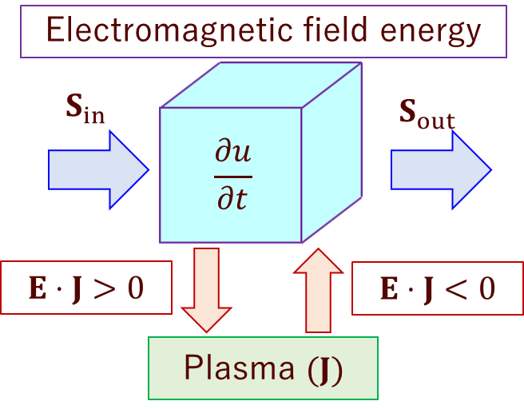
  <figcaption>図1. 電磁場エネルギーの輸送と粒子の運動エネルギー変化の概念図</figcaption>
</figure>

式(1)と式(2)を比較すると、項 $\mathbf{E} \cdot \mathbf{J}$ (単位時間、単位体積あたりのジュール熱)が電磁場とプラズマの間のエネルギー交換を媒介していることがわかる。図1に示すように、このエネルギー輸送は以下のように解釈できる。

- エネルギーの連続性:
もし電流が存在しない($\mathbf{J} = \mathbf{0}$)場合、式(1)は $\partial u / \partial t + \nabla \cdot \mathbf{S} = 0$となり、エネルギー流束の流入($\mathbf{S}_{\mathrm{in}}$)・流出($\mathbf{S}_{\mathrm{out}}$)のみで閉じられた単純な連続の式となる。
- 相互作用の鍵としての $\mathbf{E} \cdot \mathbf{J}$
電流が生じている領域では、この項が場と粒子のエネルギーを結合させる。
  - $\mathbf{E} \cdot \mathbf{J} > 0$の場合: 電磁場が粒子に仕事をなし、エネルギーは**電磁場からプラズマへ**と受け渡される (粒子の加速)。
  - $\mathbf{E} \cdot \mathbf{J} < 0$の場合: 粒子が電磁場に対して仕事をなし、エネルギーは**プラズマから電磁場へ**と受け渡される (波動の励起)。

巨視的な視点からは、波動粒子相互作用は式(1)と式(2)に現れる結合項 $\mathbf{E} \cdot \mathbf{J}$を通じた、場と粒子の間のエネルギー遷移として記述される。一方、次節で詳述するように、このプロセスは微視的には、特定の共鳴条件を満たす粒子群が波動の位相に同期し、電磁場から正味の仕事を受ける(あるいは場に仕事をなす)過程として解釈される。

### 2. 共鳴条件付近の粒子分布
作成中…

## II. WPIA手順

波動粒子相互作用における場と粒子のエネルギー交換、および波動の周波数変化を記述する指標として、物理量$W_{\mathrm{Eint}}$[^2][^3]と $W_{\mathrm{Bint}}$[^4]を、以下のように定義する。
$$
\begin{align*}
  W_{\mathrm{Eint}} &:= \sum_{i=1}^{N} \mathbf{v}_{\perp i} \cdot \mathbf{E}_{\mathrm{w}i} \tag{3}, \\
  W_{\mathrm{Bint}} &:= \sum_{i=1}^{N} \mathbf{v}_{\perp i} \cdot \mathbf{B}_{\mathrm{w}i}. \tag{4}.
\end{align*}
$$
WPIAでは、これらの指標の算出に加え、位相空間 $\left( K, \alpha, \zeta \right)$ (ここで $K$: 運動エネルギー、$\alpha$: ピッチ角、$\zeta := \phi - \psi$、$\phi$: ジャイロ位相、$\psi$: 波の位相) 上における粒子分布の可視化を行う。
以下に、Arase衛星のLEP-iデータを用いた具体的な解析フローを示す。

### 1. 環境構築
解析には、SPEDASのPython実装である`pyspedas`およびArase衛星用プラグイン`ergpyspedas`を基盤とし、データ構造の操作に`xarray`、`numpy`、`scipy`を用いる。
```bash
# 依存ライブラリのインストール
python -m pip install pyspedas numpy xarray scipy matplotlib
# ERG-SC公式プラグイン（最新開発版）のインストール
python -m pip install --upgrade --force-reinstall git+https://github.com/ergsc-devel/pyspedas_plugin.git
```

### 2. 粒子データの時系列再構築と衛星座標系における観測機器の視線方向ベクトルの導出
LEP-i[^5][^6]で観測した陽子の3D Fluxデータをロードする[^10]。(ここではShoji et al. (2021)[^1]で使用した版のデータを使用する。) WPIAの実行に際し、スピン周期(8 sec)でまとめられたデータを、個々の粒子カウントが実際に発生した観測時刻へと展開する必要がある。
```python
import pyspedas as psp
import ergpyspedas.erg as ergpy
import xarray as xr
import numpy as np

time_range = ['2017-11-15/16:10:00', '2017-11-15/16:27:00']
ergpy.lepi(time_range, datatype='3dflux', get_support_data=True, version='v03_00')

# flux3d本体 (dims = time, v1(energy), v2(channel number), v3(spin phase))
flux3d = psp.get_data('erg_lepi_l2_3dflux_FPDU', xarray=True).sel(
    time=slice(*time_range)
)

# 各軸の座標
time_ax     = flux3d.time.values        # shape = (T,)
energy_ax   = flux3d.v1.values          # (E,)
channel_ax  = flux3d.v2.values          # (C,)
spin_ax     = flux3d.v3.values          # (S,)

time_num, energy_num, channel_num, spin_num = len(time_ax), len(energy_ax), len(channel_ax), len(spin_ax)   # T, E, C, S
```

<figure align="center">
  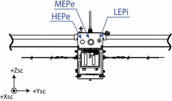
  <figcaption>図2. Location of LEPi on ERG satellite. (According to Figure 1 of Asamura et al. (2018).)</figcaption>
</figure>

<figure align="center">
  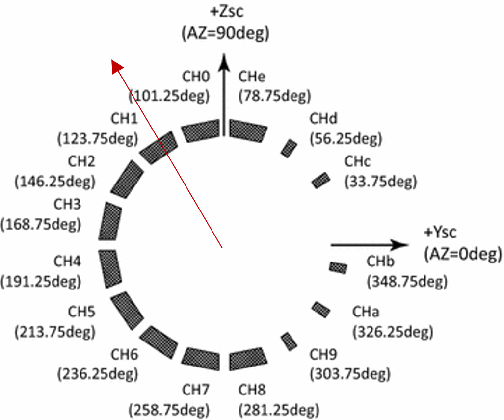
  <figcaption>図3. Channel definition of LEPi. LEPi has a planar FOV in the Y_sc‒Z_sc plane. Illustrated direction corresponds to the velocity direction of the incoming particles. Channels 0-8, and e are wide channels, while channels 9-d are narrow channels. The positions of the center of the anodes in the satellite frame of reference are shown in parentheses. 本WPIAでは、Channel 0‒8を使用する。赤矢印の方向が視線方向(粒子の単位速度ベクトル)になる。 (Asamura et al. (2018)のFigure 2を加筆。)</figcaption>
</figure>

<figure align="center">
  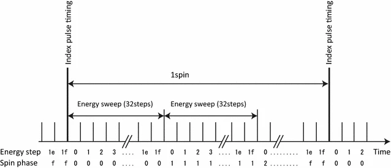
  <figcaption>図4. Measurement timing of LEPi with the index pulse. Spin phase is determined by the reception timing of the index pulse. (According to Figure 9 of Asamura et al. (2018).)</figcaption>
</figure>

<figure align="center">
  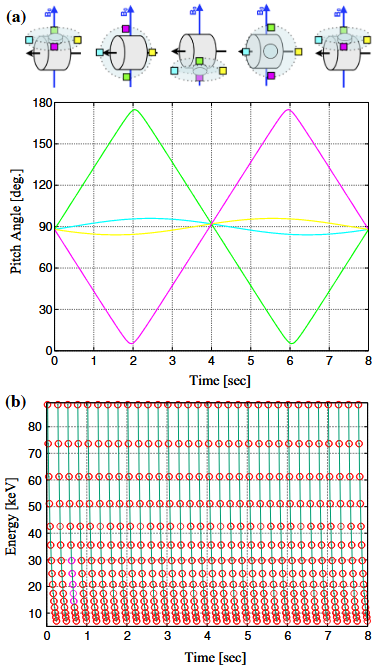
  <figcaption>図5. 観測の参考イメージとして、MEP-eでの観測ステップを引用。 (a) Variation of the pitch angle at the center of the field-of-view for sensor channels of the MEP-e during one spin period of 8 sec under the assumed condition. Schematics show in the upper panel represent the FOV of each sensor channel every 2 sec, where the color of rectangles corresponds to those of plotted lines. (b) Energy range measured by MEP-e during one spin period, where 16 energy steps are swept every 0.25 sec. (According to Figure 2 of Katoh et al. (2018).)</figcaption>
</figure>

Asamura et al. (2018) [^6] によれば、LEP-iは1スピン（8秒）の間に16のスピン位相（0.5秒/ステップ）をもち、各ステップ内でエネルギーを32段階（15.625ミリ秒/ステップ）で掃引することで、速度空間の全容を捉える(図2-4[^6]と図5[^7]参照)。WPIAでは、この観測サイクルを考慮し、3D Fluxデータの各ビンを実際の観測時刻へ再割り当てする。なお、LEP-iエネルギー掃引の32段階のうち、step 0と30、31は測定結果には使用しない。
```python
# 1 spin time = 8 sec
# 1 spin phase time = 0.5 sec
# 1 energy time step = 15625 μsec
spin_offset_ns      = np.arange(spin_num, dtype='timedelta64[ns]') * 500_000_000        # 0.5 sec = 500,000,000 nsec
energy_offset_ns    = (np.arange(energy_num, dtype='int64') * 15_625_000 + 7_812_500).astype('timedelta64[ns]')

offset_ns           = energy_offset_ns[:, None] + spin_offset_ns    # (E, 1) + (S) -> (E, S)

flux_E_TS_C = flux3d.transpose('v1_dim', 'time', 'v3_dim', 'v2_dim').values.reshape(energy_num, time_num*spin_num, channel_num)

# xarray.DataArrayをエネルギーごとに生成
flux_data_arrays = {}
for energy_i in range(energy_num):
    time_flat = (time_ax[:, None] + offset_ns[energy_i][None, :]).reshape(-1) # ((T, 1) + (1, S) -> (T, S)).reshape(-1) -> (TxS,)

    flux_data_arrays[energy_i] = xr.DataArray(
        flux_E_TS_C[energy_i],
        dims=['time', 'channel'],
        coords={
            'time':         time_flat,
            'channel':      channel_ax,
            'energy_keV':   energy_ax[energy_i]
        },
        attrs=flux3d.attrs,
        name=f'flux_energy_{energy_i}'
    )

print(flux_data_arrays)
```

併せて、衛星座標系(Spinning satellite Geometry Axis; SGA coordinate system)[^8]における各チャンネルの視線方向(単位速度ベクトル)を算出し、$\mathbf{E} \cdot \mathbf{J}$の計算に備える。
``` python
fidu_angle_dict     = psp.get_data('erg_lepi_l2_3dflux_FIDU_Angle_sga', xarray=True)
fidu_angle  = fidu_angle_dict.astype(float)     # shape (2, 3, 16)
AZ_deg_mid = fidu_angle[0, 1, :channel_num]      # shape (C,)
# AZ_deg_mid =  [ 78.75  56.25  33.75  11.25 -11.25 -33.75 -56.25 -78.75]

theta_sga = AZ_deg_mid                  # (C,)
varphi_sga = -90. * np.ones(spin_num)   # (S,)

# (TxS, C)の2次元配列を生成
theta_sga_time = np.tile(theta_sga, (time_num*spin_num, 1))   # (TxS, C)
varphi_sga_times = np.tile(varphi_sga, (time_num, 1)).reshape(-1, 1)   # (TxS, 1)
varphi_sga_time = np.tile(varphi_sga_times, (1, channel_num))   # (TxS, C)

angle_sga_time = np.stack((theta_sga_time, varphi_sga_time), axis=2)   # (TxS, C, 2)

# theta_sga, varphi_sga -> Vx_sga, Vy_sga, Vz_sga
vector_sga_time = np.zeros((time_num*spin_num, channel_num, 3))   # (TxS, C, 3)
vector_sga_time[:, :, 0] = np.cos(np.radians(angle_sga_time[:, :, 0])) * np.cos(np.radians(angle_sga_time[:, :, 1]))
vector_sga_time[:, :, 1] = np.cos(np.radians(angle_sga_time[:, :, 0])) * np.sin(np.radians(angle_sga_time[:, :, 1]))
vector_sga_time[:, :, 2] = np.sin(np.radians(angle_sga_time[:, :, 0]))

v_unit_vector_sga_energy_channel_list = {}
for energy_i in range(energy_num):
    time_flat = (time_ax[:, None] + offset_ns[energy_i][None, :]).reshape(-1)

    for channel_i in range(channel_num):
        v_unit_vector_sga_energy_channel_list[energy_i, channel_i] = xr.DataArray(
            vector_sga_time[:, channel_i, :],
            dims=['time', 'xyz'],
            coords={
                'time': time_flat,
                'xyz': ['x', 'y', 'z'],
                'channel': channel_ax[channel_i],
                'energy_keV':   energy_ax[energy_i]
            },
            name=f'v_unit_vector_sga_{energy_i}_{channel_i}'
        )
        dot_ = (v_unit_vector_sga_energy_channel_list[energy_i, channel_i] * v_unit_vector_sga_energy_channel_list[energy_i, channel_i]).sum(dim='xyz')
        print(f'v_unit_vector_sga_energy_channel_list[{energy_i}, {channel_i}] = ', np.nanmin(dot_), np.nanmax(dot_), np.nanmean(dot_))
```

### 3. 座標変換
衛星座標系(SGA)の単位速度ベクトルをDSI (Despun Sun sector Inertia)座標系[^8]に変換し、同じくDSI座標系で与えられる電場と磁場のデータと直接計算できるようにする。
以下では、``pyspedas.projects.erg.sga2sgi``と``pyspedas.projects.erg.sgi2dsi``の関数を使用することで、一度SGI (Spinning satellite Geometry Inertia)座標系を経由した座標変換を行っている。``pyspedas.projects.erg.erg_cotrans``を使用することで、SGIを介さずに、直接SGAからDSIに座標変換することも可能である[^9]。しかし著者は、過去に単位速度ベクトルを変換した際に絶対値($=1$)が保存されないというバグに遭遇したことがある。一つ一つ確認しながら実行するのが良いかもしれない。

SGA座標系 → SGI座標系の変換
```python
import pyspedas as psp
import ergpyspedas.erg as ergpy
import xarray as xr
import numpy as np

v_unit_vector_sgi_energy_channel_list = {}
for energy_i in range(energy_num):
    for channel_i in range(channel_num):
        psp.store_data(f'vector_sga_{energy_i}_{channel_i}', data={'x': v_unit_vector_sga_energy_channel_list[energy_i, channel_i].time, 'y': v_unit_vector_sga_energy_channel_list[energy_i, channel_i].values})
        # SGI座標系に変換
        psp.projects.erg.sga2sgi(name_in=f'vector_sga_{energy_i}_{channel_i}', name_out=f'vector_sgi_{energy_i}_{channel_i}')
        _data   = psp.get_data(f'vector_sgi_{energy_i}_{channel_i}', xarray=True).rename({"v_dim": "xyz"})
        v_unit_vector_sgi_energy_channel_list[energy_i, channel_i] = xr.DataArray(
            _data.data,
            dims=['time', 'xyz'],
            coords={
                'time': _data.time,
                'xyz': ['x', 'y', 'z'],
                'channel': channel_ax[channel_i],
                'energy_keV':   energy_ax[energy_i]
            },
            name=f'v_unit_vector_sgi_{energy_i}_{channel_i}'
        )

for energy_i in range(energy_num):
    for channel_i in range(channel_num):
        _dot    = (v_unit_vector_sgi_energy_channel_list[energy_i, channel_i] * v_unit_vector_sgi_energy_channel_list[energy_i, channel_i]).sum(dim='xyz')
        print(f'v_unit_vector_sgi_energy_channel_list[{energy_i}, {channel_i}] = ', np.nanmin(_dot), np.nanmax(_dot), np.nanmean(_dot))
```

SGI座標系 → DSI座標系の変換
```python
v_unit_vector_dsi_energy_channel_list = {}
for energy_i in range(energy_num):
    for channel_i in range(channel_num):
        # dsi座標系に変換
        psp.projects.erg.sgi2dsi(name_in=f'vector_sgi_{energy_i}_{channel_i}', name_out=f'vector_dsi_{energy_i}_{channel_i}')
        _data   = psp.get_data(f'vector_dsi_{energy_i}_{channel_i}', xarray=True).rename({"v_dim": "xyz"})
        v_unit_vector_dsi_energy_channel_list[energy_i, channel_i] = xr.DataArray(
            _data.data,
            dims=['time', 'xyz'],
            coords={
                'time': _data.time,
                'xyz': ['x', 'y', 'z'],
                'channel': channel_ax[channel_i],
                'energy_keV':   energy_ax[energy_i]
            },
            name=f'v_unit_vector_dsi_{energy_i}_{channel_i}'
        )

for energy_i in range(energy_num):
    for channel_i in range(channel_num):
        dot_    = (v_unit_vector_dsi_energy_channel_list[energy_i, channel_i] * v_unit_vector_dsi_energy_channel_list[energy_i, channel_i]).sum(dim='xyz')
        print(f'v_unit_vector_dsi_energy_channel_list[{energy_i}, {channel_i}] = ', np.nanmin(dot_), np.nanmax(dot_), np.nanmean(dot_))
```

### 4. 背景磁場と擾乱磁場、垂直擾乱磁場の取得
MGF[^11][^12]で観測した磁場データをロードする[^10]。ここでは、DSI座標系の`256hz`のデータを使用する。
```python
import pyspedas as psp
import ergpyspedas.erg as ergpy
import xarray as xr
import numpy as np

ergpy.mgf(trange=time_range_full, level='l2', datatype='256hz', coord='dsi', version='v03.03')

B_256Hz = psp.get_data('erg_mgf_l2_mag_256hz_dsi', xarray=True).rename({"v_dim": "xyz"})
```

本解析では、背景場を100秒移動平均で求めたものと定める。
```python
background_time_sec = 100 #[sec]
```

WPIAに移る前に、磁場 $\mathbf{B}$の様相を見てみる。背景磁場 $\mathbf{B}_{0}$、擾乱磁場 $\delta \mathbf{B} := \mathbf{B} - \mathbf{B}_{0}$、垂直擾乱磁場 $\delta \mathbf{B}_{\perp} := \delta \mathbf{B} - \mathbf{B}_{0} \left( \delta \mathbf{B} \cdot \mathbf{B}_{0} \right) / \left| \mathbf{B}_{0} \right|^{2}$ を求める。
```python
t_B_256Hz   = B_256Hz.time
dt_B_256Hz  = (t_B_256Hz[2] - t_B_256Hz[1]) / np.timedelta64(1, 's')
B_background_256Hz  = B_256Hz.rolling(time=int(background_time_sec/dt_B_256Hz), center=True).mean('time')
B_256Hz_perturb     = B_256Hz - B_background_256Hz
B_256Hz_perp = B_256Hz_perturb - (B_256Hz_perturb * B_background_256Hz).sum(dim='xyz') / (B_background_256Hz * B_background_256Hz).sum(dim='xyz') * B_background_256Hz
```

$\delta \mathbf{B}_{0}$のパワースペクトル密度 (PSD)を求めてみる。
```python
import numpy as np
import xarray as xr
from scipy.signal import spectrogram, detrend, get_window

def spectro_to_xarray(da, fs=256.0, comp=2, nperseg=4096, noverlap=None, window='hann'):
    """
    da: DataArray(time, xyz) 例: B_256Hz
    comp: 0=Bx, 1=By, 2=Bz
    返り値: Dataset {Sxx_<comp>} with coords time(freq center), freq
    """
    if noverlap is None:
        noverlap = nperseg // 2

    x = detrend(da.isel(xyz=comp).values, type='linear')
    win = get_window(window, nperseg)

    f, t, Sxx = spectrogram(x, fs=fs, window=win, nperseg=nperseg,
                            noverlap=noverlap, detrend='linear',
                            scaling='density', mode='psd')   # Sxx: (F, T)

    # spectrogram の t は開始からの秒。絶対時刻へ変換（窓中心時刻）
    t0 = da.time.values[0].astype('datetime64[ns]')
    t_abs = t0 + (np.rint(t * 1e9).astype('int64')).astype('timedelta64[ns]')

    varname = {0:'Bx', 1:'By', 2:'Bz'}[comp]
    ds = xr.Dataset(
        data_vars={f'Sxx_{varname}': (('time', 'freq'), Sxx.T)},   # (T,F)
        coords={'time': t_abs, 'freq': f},
        attrs=dict(fs=fs, nperseg=nperseg, noverlap=noverlap, window=window,
                   input_units='nT', psd_units='nT^2/Hz',
                   method='scipy.signal.spectrogram')
    )
    return ds
```
```python
ds_spec_B_256Hz_z = spectro_to_xarray(B_256Hz, fs=256.0, comp=2, nperseg=4096)
```
```python
import numpy as np
import matplotlib.pyplot as plt
from matplotlib.colors import LogNorm
import matplotlib as mpl

mpl.rcdefaults()
mpl.rcParams['font.size'] = 10

time_ax_range_min = np.datetime64('2017-11-15T16:16:00')
time_ax_range_max = np.datetime64('2017-11-15T16:25:00')

# ---- 描画 ----
plt.figure(figsize=(8, 3))
TIME, FREC = np.meshgrid(ds_spec_B_256Hz_z.time, ds_spec_B_256Hz_z.freq)
plt.pcolormesh(TIME, FREC, ds_spec_B_256Hz_z.Sxx_Bz.T, shading='auto', cmap='turbo',
               norm=LogNorm(vmin=1E-4, vmax=1E2))
plt.ylim(0.4, 1.0)
plt.xlim(time_ax_range_min, time_ax_range_max)
plt.xlabel('Time')
plt.ylabel('Frequency [Hz]')
plt.colorbar(label=r'PSD [nT$^2$/Hz]')
plt.title('Bz spectrogram (256 Hz sampling)')
plt.minorticks_on()
plt.grid(which='both', alpha=0.5, linestyle=':')
plt.tight_layout()
plt.show()
```
<figure align="center">
  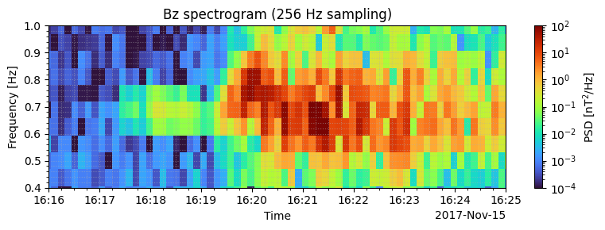
  <figcaption>図6. δBのDSI-z成分のPSD。0.4‒1 Hzにかけて、磁場擾乱が生じているのが分かる。</figcaption>
</figure>

Shoji et al. (2021)[^1]の解析に従い、0.45-0.75 Hzのバンドパスフィルタを適用する。
```python
lowcut = 0.45
highcut = 0.75
```
バンドパスの実態は、以下の通り。
```python
import numpy as np
import matplotlib.pyplot as plt
from scipy.signal import butter, sosfiltfilt, sosfreqz

# ------------------ フィルタ設計 ------------------
fs = 256.                  # サンプリング周波数 [Hz]
order = 4                   # 4次 Butterworth（2-pole × 2-stage）

# btypeを'bandpass'に設定
sos = butter(N=order, Wn=[lowcut, highcut], btype='bandpass', fs=fs, output='sos')

# ------------------ インパルス応答 (変更なし) ------------------
n = 4096
delta = np.zeros(n)
delta[n//2] = 1

h = sosfiltfilt(sos, delta)
t = (np.arange(n) - n//2) / fs

# ------------------ 周波数応答 (変更なし) ------------------
w, H = sosfreqz(sos, worN=4096, fs=fs)
H_dbl = np.abs(H)**2

# ------------------ プロット (タイトルとハイライトを変更) ------------------
fig, axs = plt.subplots(2, 1, figsize=(10, 6), tight_layout=True)

# 時間領域
axs[0].plot(t, h)
axs[0].set_title('Impulse Response (Band-pass filter)')
axs[0].set_xlabel('Time [s]')
axs[0].set_ylabel('Amplitude')
axs[0].grid(True)

# 周波数領域
axs[1].semilogx(w, 20*np.log10(H_dbl), label='|H(f)|')

# 除去帯域を半透明のグレーで示す
axs[1].axvspan(lowcut, highcut, color='gray', alpha=0.3, label=f'{lowcut:.2f}-{highcut:.2f} Hz')
axs[1].axvline(lowcut, color='red', lw=1)
axs[1].axvline(highcut, color='red', lw=1)

axs[1].set_title('Magnitude Response (Band-pass filter)')
axs[1].set_xlabel('Frequency [Hz]')
axs[1].set_ylabel('Magnitude [dB]')
axs[1].set_ylim(-20, 10)
axs[1].set_xlim(3E-1, 2E0)
axs[1].legend()
axs[1].grid(True, which='both', ls='--')

plt.show()
```
<figure align="center">
  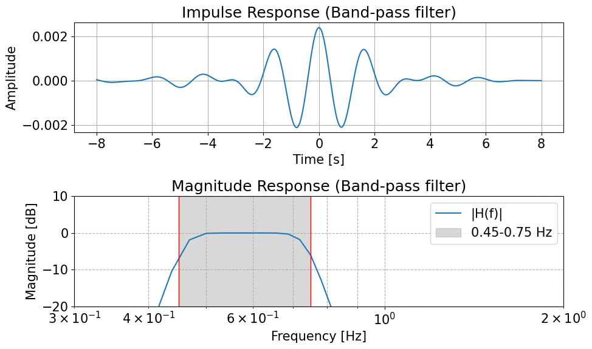
  <figcaption>図7. 0.45-0.75 Hzのバンドパスフィルタ。</figcaption>
</figure>

```python
import numpy as np
from scipy.signal import butter, sosfiltfilt

# フィルタパラメータ
fs = 256.                         # サンプリング周波数 [Hz]
order = 4                         # フィルタの次数
window_sec = background_time_sec  # 背景磁場の移動平均窓幅 [sec]

sos = butter(N=order, Wn=[lowcut, highcut], btype='bandpass', fs=fs, output='sos')

def apply_filter_segmented(y, sos_mat):
    """NaN を含む 1‑D 配列にセグメントごとで sosfiltfilt を適用する"""
    good = np.isfinite(y)
    out  = np.full_like(y, np.nan)
    idx  = np.where(good)[0]
    segs = np.split(idx, np.where(np.diff(idx) != 1)[0] + 1)
    
    # パディング長はフィルタの次数に依存
    # scipyのドキュメントによると、sosfiltfiltのデフォルトpadlenは 3 * (sos.shape[1] // 2 - 1)
    # sosの形状は (n_sections, 6) なので、padlenは 3 * 2 = 6 となる
    padlen = 3 * (sos_mat.shape[1] - 1)
    
    for s in segs:
        if s.size > padlen:
            out[s] = sosfiltfilt(sos_mat, y[s])
    return out

B_256Hz_perp_bandpass = np.zeros(B_256Hz_perp.data.shape) * np.nan  # NaNで初期化
for i in range(3):
    B_256Hz_perp_bandpass[:, i] = apply_filter_segmented(B_256Hz_perp.data[:, i], sos)
da_B_256Hz_perp_bandpass = xr.DataArray(
    B_256Hz_perp_bandpass,
    dims=B_256Hz_perp.dims,
    coords=B_256Hz_perp.coords,
    name='B_256Hz_perp_bandpass'
)

da_B_256Hz_perp_bandpass_amp = np.sqrt((da_B_256Hz_perp_bandpass * da_B_256Hz_perp_bandpass).sum(dim='xyz'))
```
```python
import matplotlib as mpl
import matplotlib.pyplot as plt

mpl.rcdefaults()
mpl.rcParams['font.size'] = 15

time_ax_range_min = np.datetime64('2017-11-15T16:16:00')
time_ax_range_max = np.datetime64('2017-11-15T16:25:00')

# plot
fig, ax = plt.subplots(1, 1, figsize=(10, 4), sharex=True)
ax.plot(da_B_256Hz_perp_bandpass_amp.time, da_B_256Hz_perp_bandpass_amp.data, lw=0.5, c='k')
ax.set_ylabel('[nT]')
ax.minorticks_on()
ax.grid(True, which='both', linestyle='--', alpha=0.5)
ax.set_xlim(time_ax_range_min, time_ax_range_max)
ax.set_ylim(0, 10)
plt.tight_layout()
plt.show()
```
<figure align="center">
  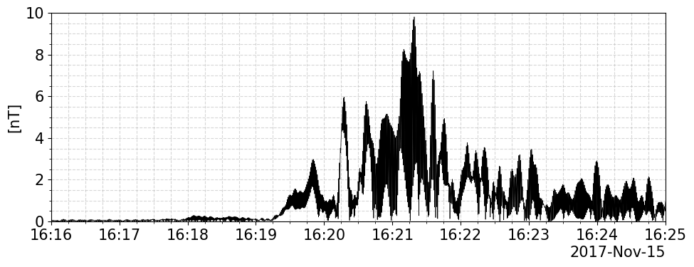
  <figcaption>図8. 0.45-0.75 Hzのバンドパスフィルタを適用した垂直磁場擾乱の振幅。</figcaption>
</figure>

### 5. ピッチ角とゼータ角の算出
DSI座標系の単位速度ベクトル $\hat{\mathbf{v}}$から、ピッチ角 $\alpha := \arctan \left( v_{\perp} / v_{\parallel} \right)$とゼータ角 $\zeta := \phi - \psi$を算出する。ここで、$v_{\perp}$と $v_{\parallel}$はそれぞれ背景磁場に対して垂直または平行方向の速度成分である。$\phi$と$\psi$はそれぞれ粒子のジャイロ位相と波の位相である。ピッチ角とゼータ角は、背景磁場 $\mathbf{B}_{0}$と垂直擾乱磁場 $\delta \mathbf{B}_{\perp}$を用いて次のように計算される。
$$
\begin{align*}
  \alpha &= \arccos \left( \frac{\hat{\mathbf{v}} \cdot \mathbf{B}_{0}}{\sqrt{\mathbf{B}_{0} \cdot \mathbf{B}_{0}}} \right), \tag{5} \\
  \hat{\mathbf{v}}_{\perp} & := \hat{\mathbf{v}} - \mathbf{B}_{0} \frac{\hat{\mathbf{v}} \cdot \mathbf{B}_{0}}{\mathbf{B}_{0} \cdot \mathbf{B}_{0}}, \\
  \zeta &= \arctan2 \left( - \frac{\hat{\mathbf{v}}_{\perp} \times \delta \mathbf{B}_{\perp}}{\sqrt{\delta \mathbf{B}_{\perp} \cdot \delta \mathbf{B}_{\perp}}} \cdot \frac{\mathbf{B}_{0}}{\sqrt{\mathbf{B}_{0} \cdot \mathbf{B}_{0}}}, \frac{\hat{\mathbf{v}}_{\perp} \cdot \delta \mathbf{B}_{\perp}}{\sqrt{\delta \mathbf{B}_{\perp} \cdot \delta \mathbf{B}_{\perp}}} \right). \tag{6}
\end{align*}
$$
式(6)は、以下の計算過程に従い導出される。なお、沿磁力線座標系に従う。
$$
\begin{align*}
  \hat{\mathbf{v}}_{\perp} &= \left( \cos \phi, \sin \phi, 0 \right), \\
  \hat{\mathbf{B}}_{0} &= \frac{\mathbf{B}_{0}}{\sqrt{\mathbf{B}_{0} \cdot \mathbf{B}_{0}}}= \left( 0, 0, 1 \right), \\
  \delta \hat{\mathbf{B}}_{\perp} &:= \frac{\delta \mathbf{B}_{\perp}}{\left| \delta \mathbf{B}_{\perp} \right|} = \left( \cos \psi, \sin \psi, 0 \right), \\
  \hat{\mathbf{v}}_{\perp} \cdot \delta \hat{\mathbf{B}}_{\perp} &= \cos \phi \cos \psi + \sin \phi \sin \psi = \cos \left( \phi - \psi \right) \\
  &= \cos \zeta, \\
  \hat{\mathbf{v}}_{\perp} \times \delta \hat{\mathbf{B}}_{\perp} &= \left( 0, 0, \cos \phi \sin \psi - \sin \phi \cos \psi \right) \\
  &= \left( 0, 0, - \sin \zeta \right), \\
  \zeta &= \arctan2 \left( \sin \zeta, \cos \zeta \right) \\
  &= \arctan2 \left( - \left\{ \hat{\mathbf{v}}_{\perp} \times \delta \hat{\mathbf{B}}_{\perp} \right\} \cdot \hat{\mathbf{B}}_{0}, \hat{\mathbf{v}}_{\perp} \cdot \delta \hat{\mathbf{B}}_{\perp} \right).
\end{align*}
$$
ここで、関数$\arctan2 \left( x, y \right)$は、`numpy.arctan2`[^13]に従う。

式(5)と式(6)より $\alpha$と $\zeta$を算出し、Fluxデータに格納する。
```python
import numpy as np
import xarray as xr

def ensure_xyz_coord(da):
    if 'xyz' in da.dims and 'xyz' not in da.coords:
        da = da.assign_coords(xyz=['x','y','z'])
    return da

flux_pitch_zeta_data_list    = {}
for energy_i in range(energy_num):
    for channel_i in range(channel_num):
        v_unit  = v_unit_vector_dsi_energy_channel_list[energy_i, channel_i]
        B0 = B_background_256Hz.interp(time=v_unit.time)
        Bperp = da_B_256Hz_perp_bandpass.interp(time=v_unit.time)
        Bperp = Bperp - (Bperp * B0).sum(dim='xyz') / (B0 * B0).sum(dim='xyz') * B0

        v_unit  = ensure_xyz_coord(v_unit)
        B0      = ensure_xyz_coord(B0)
        Bperp   = ensure_xyz_coord(Bperp)

        dot_vB0 = (v_unit * B0).sum(dim='xyz')
        B0_2    = (B0 * B0).sum(dim='xyz')
        alpha = np.arccos(dot_vB0 / np.sqrt(B0_2))

        v_perp = v_unit - dot_vB0 / B0_2 * B0
        cross = xr.apply_ufunc(np.cross, Bperp, v_perp,
                               input_core_dims=[['xyz'], ['xyz']],
                               output_core_dims=[['xyz']], vectorize=True)
        Bperp_2     = (Bperp * Bperp).sum(dim='xyz')
        sin_zeta    = (cross * B0).sum(dim='xyz') / np.sqrt(B0_2 * Bperp_2)
        cos_zeta    = (v_perp * Bperp).sum(dim='xyz') / np.sqrt(Bperp_2)
        zeta = np.atan2(sin_zeta, cos_zeta)
        
        # 時間を統一（zeta基準）
        t = zeta['time']
        
        # flux の time を zeta に合わせる（必要なら補間）
        flux_ch = xr.DataArray(
            flux_data_arrays[energy_i][:, channel_i],
            coords={'time': flux_data_arrays[energy_i].coords['time']},  # ここは実データのtimeに合わせる
            dims=('time',)
        ).interp(time=t)
        
        da = xr.concat(
            [
                flux_ch.rename('differential_number_flux_keV'),
                np.rad2deg(alpha).rename('pitch_angle_deg'),
                (np.rad2deg(zeta) % 360.0).rename('zeta_angle_deg')
            ],
            dim='variable'
        ).assign_coords(variable=['differential_number_flux_keV','pitch_angle_deg','zeta_angle_deg']) \
         .transpose('time','variable')
        
        flux_pitch_zeta_data_list[energy_i, channel_i] = da.assign_coords(
            channel=channel_ax[channel_i],
            energy_keV=energy_ax[energy_i],
        )
        print(flux_pitch_zeta_data_list[energy_i, channel_i])
```

試しに、Fluxデータをプロットしてみる。
```python
import numpy as np
import matplotlib.pyplot as plt
import matplotlib.dates as mdates
import matplotlib.colors as mcolors
import matplotlib.cm as cm
import matplotlib as mpl

mpl.rcdefaults()
mpl.rcParams['font.size'] = 15

time_ax_range_min = np.datetime64('2017-11-15T16:17:00')
time_ax_range_max = np.datetime64('2017-11-15T16:25:00')

for energy_i in range(energy_num):
    if energy_i != 5:
        continue

    # --- 1) 全channelでvmin/vmaxを決める（>0 かつ有限のみ） ---
    flux_vals = []
    alpha_vals = []
    for channel_i in range(channel_num):
        d = flux_pitch_zeta_data_list[energy_i, channel_i].sel(time=slice(time_ax_range_min, time_ax_range_max))
        f = d.sel(variable='differential_number_flux_keV').values
        alpha = d.sel(variable='pitch_angle_deg').values
        flux_vals.append(f.ravel())
        alpha_vals.append(alpha.ravel())
    flux_all = np.concatenate(flux_vals)
    alpha_all = np.concatenate(alpha_vals)
    mask = np.isfinite(flux_all) & (flux_all > 0) & (alpha_all > 125) & (alpha_all < 145)
    if not mask.any():
        continue
    vmin, vmax = np.nanpercentile(flux_all[mask], 5), np.nanpercentile(flux_all[mask], 95)
    if np.log10(vmin) < np.log10(vmax) -2:
        vmin = vmax*1E-2
    norm = mcolors.LogNorm(vmin=vmin, vmax=vmax)
    cmap = 'turbo'

    # --- 2) 描画 ---
    fig = plt.figure(figsize=(10, 12))
    ax0 = fig.add_subplot(211)
    ax1 = fig.add_subplot(212)

    for channel_i in range(channel_num):
        #if channel_i != 0:
        #    continue
        d = flux_pitch_zeta_data_list[energy_i, channel_i].sel(time=slice(time_ax_range_min, time_ax_range_max))
        t = d['time'].values
        flux = d.sel(variable='differential_number_flux_keV').values
        alpha = d.sel(variable='pitch_angle_deg').values
        zeta  = d.sel(variable='zeta_angle_deg').values

        mask = (alpha >= 125) & (alpha <= 145) & (flux > 0)
        t_mask  = t[mask]
        flux_mask   = flux[mask]
        flux_mask_ratio = flux_mask
        alpha_mask  = alpha[mask]
        zeta_mask   = zeta[mask]
        ax0.scatter(t_mask, alpha_mask, c=flux_mask_ratio, s=10, cmap=cmap, norm=norm, rasterized=True)
        ax1.scatter(t_mask, zeta_mask,  c=flux_mask_ratio, s=10, cmap=cmap, norm=norm, rasterized=True)

    # 軸体裁
    ax0.set_ylabel(r'Pitch Angle $\alpha$' + '\n[deg]')
    ax1.set_ylabel(r'Phase difference $\zeta$' + '\n[deg]')

    ax0.set_title(f'LEP-i flux (energy = {energy_ax[energy_i]:.4f} keV)')
    for ax in (ax0, ax1):
        ax.xaxis.set_major_formatter(mdates.DateFormatter('%H:%M'))
        ax.minorticks_on()
        ax.grid(True, which='both', linestyle='--', alpha=0.5)
        ax.set_xlim(time_ax_range_min, time_ax_range_max)
    ax0.set_ylim(0, 180);  ax0.set_yticks(np.arange(0, 181, 15))
    ax1.set_ylim(0, 360);  ax1.set_yticks(np.arange(0, 361, 30))

    # --- 3) カラーバーは共通norm/cmapから作る ---
    sm = cm.ScalarMappable(norm=norm, cmap=cmap)
    sm.set_array([])  # 必須
    plt.colorbar(sm, ax=ax0, label='Differential number flux\n' + r'[$\mathrm{s}^{-1}\mathrm{cm}^{-2}\mathrm{str}^{-1}\mathrm{keV}^{-1}$]')
    plt.colorbar(sm, ax=ax1, label='Differential number flux\n' + r'[$\mathrm{s}^{-1}\mathrm{cm}^{-2}\mathrm{str}^{-1}\mathrm{keV}^{-1}$]')

    plt.tight_layout()
    plt.show()
```
<figure align="center">
  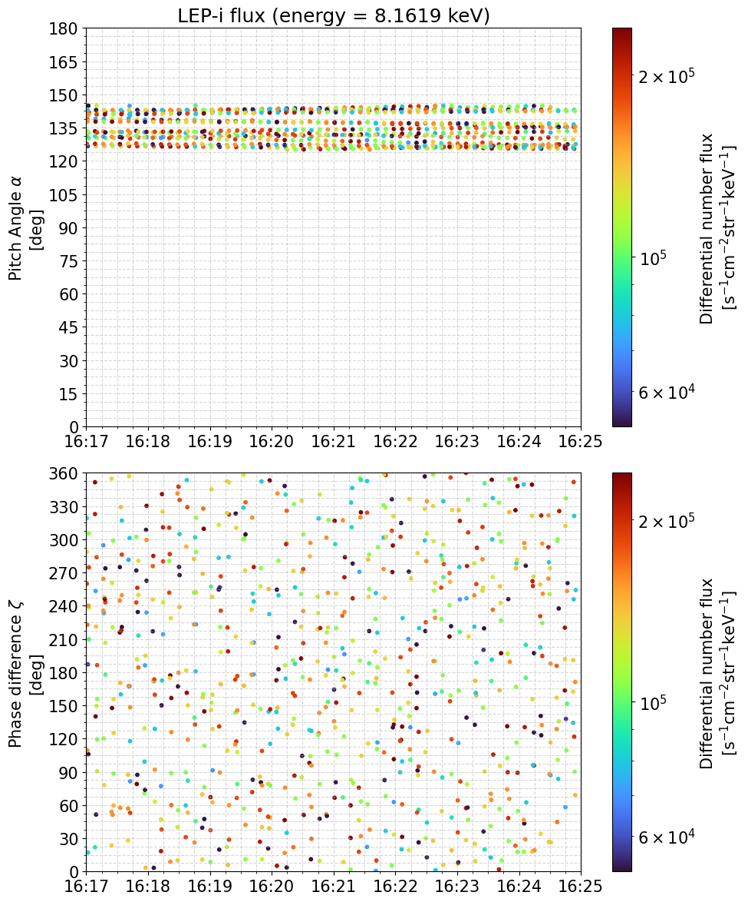
  <figcaption>図8. 8.16 keV帯の陽子の微分フラックスの散布図。プロットは観測で注目するピッチ角125°‒145°に制限した。</figcaption>
</figure>


### 6. 微分フラックスを粒子カウント数に変換
Differential number flux $J$と粒子カウント数 $C$の間には、以下の関係式がある。
$$
C = \tau \cdot G \cdot E_{\mathrm{center}} \cdot J . \tag{7}
$$
ここで、$\tau$はサンプリング時間 (Arase: 0.015625 s)、$G$はg-factor (Arase: $\left\{ 1.52 - 0.108 \log_{10} \left( E_{\mathrm{center}} / q \right) \right\} \times 10^{-3} \, [\mathrm{cm}^{2} \, \mathrm{str} \, \mathrm{keV} / \mathrm{keV}]$)、$E_{\mathrm{center}}$は中心エネルギー。なお、式(7)には通常、検出効率である $\varepsilon$が右辺に掛かる形、つまり
$$
C = \tau \cdot \varepsilon \cdot G \cdot E_{\mathrm{center}} \cdot J .
$$
となる。LEP-iの静電検出器の $\varepsilon$は、Asamura et al. (2018)[^6]に記載がない(TOFモードについては記載あり)。また、Shoji et al. (2021)[^1]のMethodsの $W_{\mathrm{Eint}}$の式では、$\varepsilon$の記載がない。よって、Shoji et al. (2021)の結果の再現にあたり $\varepsilon$は考えないこととする。実際にWPIAを行う場合は、装置のPIに確認を取ること。
```python
sampling_time   = 0.015625  # [sec]
```
```python
def G_Factor_func(energy):
    return  (1.52 - 0.108 * np.log10(energy)) * 1E-3  # [cm^2 str keV keV^-1]

G_Factor_ax = G_Factor_func(energy_ax)
```
```python
import numpy as np
import matplotlib.pyplot as plt

fig, ax = plt.subplots(1, 1, figsize=(8, 5), sharex=True)
ax.plot(energy_ax, G_Factor_ax, lw=2, c='red')
ax.set_xlabel(r'Energy per charge [$\mathrm{keV/q}$]')
ax.set_ylabel(r'G-Factor ($G_{\mathrm{ESA}}$)' + '\n' + r'[$\mathrm{cm}^{2} \, \mathrm{str} \, \mathrm{keV} \, \mathrm{keV}^{-1}$]')
ax.minorticks_on()
ax.grid(True, which='both', linestyle='--', alpha=0.5)
ax.set_xscale('log')
ax.set_xlim(np.nanmin(energy_ax), np.nanmax(energy_ax))
ax.set_ylim(0.00135, 0.0018)
ax.axvline(0.01, c='b', linestyle=':', lw=2)
ax.axhline(0.00170, c='b', linestyle=':', lw=2)
ax.axvline(12, c='orange', linestyle=':', lw=2)
ax.axhline(0.00140, c='orange', linestyle=':', lw=2)
plt.tight_layout()
plt.show()
```
<figure align="center">
  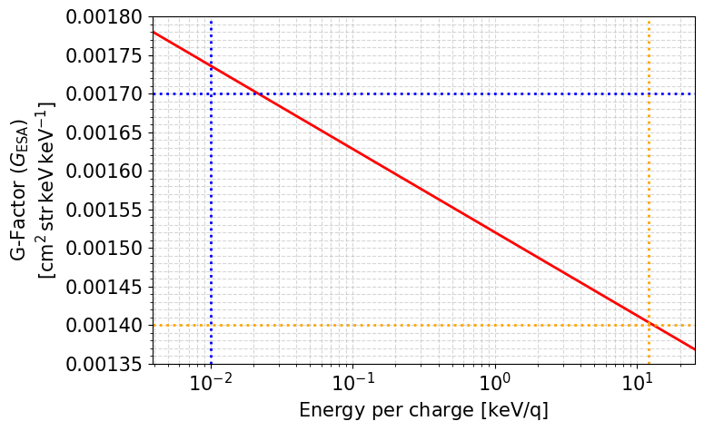
  <figcaption>図9. LEP-iのWide channelでのG-Factor。Asamura et al. (2018)のTable 1には、代表値として1.7*10^3 at 0.01 keV/q(図中の青線)と1.4*10^3 at 12 keV/q(図中の橙線)が記載されている。</figcaption>
</figure>

Differential number fluxデータを、粒子カウント数データに変換する。
```python
count_pitch_zeta_data_list    = {}
for energy_i in range(energy_num):
    for channel_i in range(channel_num):
        data_ = flux_pitch_zeta_data_list[energy_i, channel_i]
        G_Factor_   = G_Factor_func(energy_ax[energy_i])

        count_ch = sampling_time * G_Factor_ * energy_ax[energy_i] * data_[:, 0]   # C = τ * G * E * J

        da = xr.concat(
            [
                count_ch.rename('count_number'),
                data_[:, 1],
                data_[:, 2]
            ],
            dim='variable'
        ).assign_coords(variable=['count_number','pitch_angle_deg','zeta_angle_deg']) \
         .transpose('time','variable')
        
        count_pitch_zeta_data_list[energy_i, channel_i] = da.assign_coords(
            channel=channel_ax[channel_i],
            energy_keV=energy_ax[energy_i],
        )
        print(energy_ax[energy_i])
        print(count_pitch_zeta_data_list[energy_i, channel_i][900:930, :])
```
```python
import numpy as np
import matplotlib.pyplot as plt
import matplotlib.dates as mdates
import matplotlib.colors as mcolors
import matplotlib.cm as cm
import matplotlib as mpl

mpl.rcdefaults()
mpl.rcParams['font.size'] = 15

time_ax_range_min = np.datetime64('2017-11-15T16:17:00')
time_ax_range_max = np.datetime64('2017-11-15T16:22:00')

for energy_i in range(energy_num):
    if (energy_i != 5):
        continue

    # --- 1) 全channelでvmin/vmaxを決める（>0 かつ有限のみ） ---
    count_vals = []
    alpha_vals = []
    for channel_i in range(channel_num):
        d = count_pitch_zeta_data_list[energy_i, channel_i].sel(time=slice(time_ax_range_min, time_ax_range_max))
        f = d.sel(variable='count_number').values
        alpha = d.sel(variable='pitch_angle_deg').values
        count_vals.append(f.ravel())
        alpha_vals.append(alpha.ravel())
    count_all = np.concatenate(count_vals)
    alpha_all = np.concatenate(alpha_vals)
    mask = np.isfinite(count_all) & (alpha_all >= 125) & (alpha_all <= 145)
    if not mask.any():
        continue
    vmin, vmax = np.nanpercentile(count_all[mask], 5), np.nanpercentile(count_all[mask], 95)
    norm = mcolors.LogNorm(vmin=vmin, vmax=vmax)
    cmap = 'turbo'

    # --- 2) 描画 ---
    fig = plt.figure(figsize=(10, 12))
    ax0 = fig.add_subplot(211)
    ax1 = fig.add_subplot(212)

    for channel_i in range(channel_num):
        d = count_pitch_zeta_data_list[energy_i, channel_i].sel(time=slice(time_ax_range_min, time_ax_range_max))
        t = d['time'].values
        count = d.sel(variable='count_number').values
        alpha = d.sel(variable='pitch_angle_deg').values
        zeta  = d.sel(variable='zeta_angle_deg').values
        mask = np.isfinite(count) & (alpha > 125) & (alpha < 145)
        t   = t[mask]
        count   = count[mask]
        alpha   = alpha[mask]
        zeta    = zeta[mask]
        ax0.scatter(t, alpha, c=count, s=10, cmap=cmap, norm=norm, rasterized=True)
        ax1.scatter(t, zeta,  c=count, s=10, cmap=cmap, norm=norm, rasterized=True)

    # 軸体裁
    ax0.set_ylabel(r'Pitch Angle $\alpha$' + '\n[deg]')
    ax1.set_ylabel(r'Phase difference $\zeta$' + '\n[deg]')

    ax0.set_title(f'LEP-i count number (energy = {energy_ax[energy_i]:.4f} keV)')
    for ax in (ax0, ax1):
        ax.xaxis.set_major_formatter(mdates.DateFormatter('%H:%M:%S'))
        ax.minorticks_on()
        ax.grid(True, which='both', linestyle='--', alpha=0.5)
        ax.set_xlim(time_ax_range_min, time_ax_range_max)
    ax0.set_ylim(0, 180);  ax0.set_yticks(np.arange(0, 181, 10))
    ax1.set_ylim(0, 360);  ax1.set_yticks(np.arange(0, 361, 30))

    # --- 3) カラーバーは共通norm/cmapから作る ---
    sm = cm.ScalarMappable(norm=norm, cmap=cmap)
    sm.set_array([])  # 必須
    plt.colorbar(sm, ax=ax0, label='Count Number')
    plt.colorbar(sm, ax=ax1, label='Count Number')

    plt.tight_layout()
    plt.show()
```
<figure align="center">
  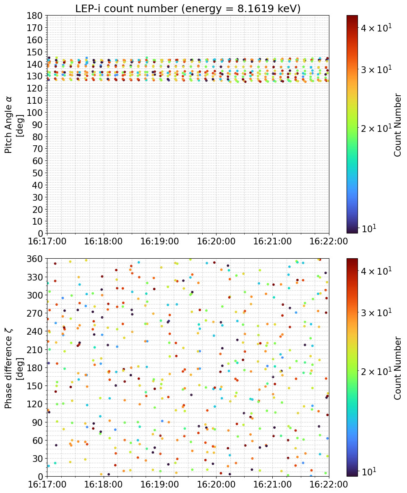
  <figcaption>図10. 8.16 keV帯の陽子の粒子カウント数の散布図。プロットは観測で注目するピッチ角125°‒145°に制限した。</figcaption>
</figure>


### 7. 各ゼータ角ビンに、粒子カウント数を分配
Shoji et al. (2021)[^1]に従い、125°以上145°以下のピッチ角の陽子に焦点を当てる。
$\zeta$角ビンを設置し(本文では30°ごと: 0°, 30°, ..., 330°)、粒子カウント数を各ビンに分配する。元々の $\zeta$を考慮し、近傍の $\zeta$角ビン($\zeta_0 < \zeta < \zeta_1$)に $C_0$と $C_1$で分配する。
$$
C_0 = \frac{\zeta_1 - \zeta}{\zeta_1 - \zeta_0} C, \quad C_1 = \frac{\zeta - \zeta_0}{\zeta_1 - \zeta_0} C. \tag{8}
$$
このとき、粒子カウント数 $C$の計測誤差は$\sqrt{C}$で与えられる(計数実験についての平方根則(The square-root rule for a counting experiment))[^3]。$C$が60を超える場合$\sqrt{C}$は13%以下となり、誤差は小さいと考えられる[^1]。しかし、図10に示す通り、実際の粒子カウント数は時間でまばらであり、且つ十分ではない。そこで、ある時刻 $t_{\mathrm{center}}$について、$t_{\mathrm{center}} \pm T_{\mathrm{window}} / 2$ secの範囲で足し合わせることで、十分な粒子カウント数を得るようにする。一方で、後述のプロトンホールの変化の時間スケールを超えるような長時間で足し合わせては、波動粒子相互作用を追うことが困難になる。本文では $T_{\mathrm{window}} = 60$ secとした。
なお、粒子カウント数が十分であることは、単純な粒子カウント数の足し合わせで評価する一方で、実際の解析では粒子カウント数をoccurenceで正規化した値を用いる。
```python
import numpy as np
import xarray as xr

def make_weighted_zeta_counts_for_energy_periodic_avg(
    count_pitch_zeta_data_list,
    energy_i,
    channel_num,
    time_start,
    time_end,
    T_integrate=60.0,      # [s]
    step_sec=4.0,          # [s]
    alpha_min=125.0,
    alpha_max=145.0,
    zeta_bin_width=30.0    # [deg]
):
    """
    1エネルギーチャンネルについて、ピッチ角 α∈[alpha_min, alpha_max] の
    カウントを ζ ビン(0,30,...,330)に重み付きで分配し、
    各ビンごとに [Σ(C * weight) / Σ(weight)] を返す（ζ は周期境界）。
    """

    # ζ グリッド（ビン中心）
    zeta_centers = np.arange(0., 360.0, zeta_bin_width)  # 0,30,...,330
    n_bins       = zeta_centers.size

    # 時間中心 tc のリスト
    time_start = np.datetime64(time_start)
    time_end   = np.datetime64(time_end)
    tc_list = np.arange(
        time_start,
        time_end + np.timedelta64(1, "s"),
        np.timedelta64(int(step_sec), "s")
    ).astype("datetime64[ns]")

    # 積分時間の半分
    T_half = np.timedelta64(int(T_integrate / 2), "s")

    # 出力配列 (tc, zeta_bin)
    num_tc_zeta = np.zeros((tc_list.size, n_bins), dtype=float)  # Σ(C * weight)
    den_tc_zeta = np.zeros((tc_list.size, n_bins), dtype=float)  # Σ(weight)

    for itc, tc in enumerate(tc_list):
        t0 = tc - T_half
        t1 = tc + T_half

        for ch in range(channel_num):
            d = count_pitch_zeta_data_list[energy_i, ch].sel(time=slice(t0, t1))
            if d.time.size == 0:
                continue

            count = d.sel(variable="count_number").values
            alpha = d.sel(variable="pitch_angle_deg").values
            zeta  = d.sel(variable="zeta_angle_deg").values

            # 有効データ & α 範囲
            mask = (
                np.isfinite(count)
                & np.isfinite(alpha)
                & np.isfinite(zeta)
                & (alpha >= alpha_min)
                & (alpha <= alpha_max)
                & (count >= 1.)
            )
            if not mask.any():
                continue

            c = count[mask].ravel()
            a = alpha[mask].ravel()
            z = zeta[mask].ravel()

            # ---- 周期境界つき ζ 線形分配 ----
            # [0, 360) に折りたたみ
            z_mod = np.mod(z, 360.0)

            # 左のビン中心 index (0..n_bins-1)
            i0 = np.floor(z_mod / zeta_bin_width).astype(int)
            i0 = np.clip(i0, 0, n_bins - 1)

            # 右のビン中心（周期境界）
            i1 = (i0 + 1) % n_bins

            # 左の中心角 ζ0
            z0 = zeta_centers[i0]
            z1 = zeta_centers[i1]
            dz = zeta_bin_width  # Δζ は一定

            # 線形重み
            w1 = ((z_mod - z0) / dz)
            w0 = (1.0 - w1)

            # 分子: Σ(C * weight)
            np.add.at(num_tc_zeta[itc], i0, c * w0)
            np.add.at(num_tc_zeta[itc], i1, c * w1)

            # 分母: Σ(weight)
            np.add.at(den_tc_zeta[itc], i0, w0)
            np.add.at(den_tc_zeta[itc], i1, w1)
            # ---- ここまで ----

    # 重み付き平均
    with np.errstate(invalid='ignore', divide='ignore'):
        counts_tc_zeta_norm = num_tc_zeta / den_tc_zeta
        counts_tc_zeta      = num_tc_zeta

    da = xr.DataArray(
        counts_tc_zeta,
        coords={
            "time_center": tc_list,
            "zeta_center": zeta_centers,
        },
        dims=("time_center", "zeta_center"),
        name="count_weighted_avg",
        attrs={
            "T_integrate_sec": T_integrate,
            "step_sec": step_sec,
            "alpha_min": alpha_min,
            "alpha_max": alpha_max,
            "zeta_bin_width_deg": zeta_bin_width,
        },
    )

    da_norm = xr.DataArray(
        counts_tc_zeta_norm,
        coords={
            "time_center": tc_list,
            "zeta_center": zeta_centers,
        },
        dims=("time_center", "zeta_center"),
        name="count_weighted_avg",
        attrs={
            "T_integrate_sec": T_integrate,
            "step_sec": step_sec,
            "alpha_min": alpha_min,
            "alpha_max": alpha_max,
            "zeta_bin_width_deg": zeta_bin_width,
        },
    )
    return da, da_norm
```
```python
count_zeta_bin_data_list    = {}
count_zeta_norm_bin_data_list    = {}

for energy_i in range(energy_num):
    if energy_i != 5:
        continue
    da_weighted, da_weighted_norm = make_weighted_zeta_counts_for_energy_periodic_avg(
        count_pitch_zeta_data_list,
        energy_i=energy_i,
        channel_num=channel_num,
        time_start=np.datetime64('2017-11-15T16:15:00'),
        time_end=np.datetime64('2017-11-15T16:25:00'),
        T_integrate=60.0,
        step_sec=4.0,
        alpha_min=125.0,
        alpha_max=145.0,
        zeta_bin_width=30.
    )
    count_zeta_bin_data_list[energy_i]      = da_weighted
    count_zeta_norm_bin_data_list[energy_i] = da_weighted_norm

print(count_zeta_bin_data_list)
print('')
print(count_zeta_norm_bin_data_list)
```

16:21:00における各 $\zeta$ビンの粒子カウント数と誤差をプロットしてみる。
```python
import numpy as np
import matplotlib.pyplot as plt

# ---- パラメータ ----
energy_i = 5
t_target = np.datetime64('2017-11-15T16:21:00')  # 見たい中心時刻

# ---- 対象エネルギーの DataArray を取り出し、時刻を1本に絞る ----
da          = count_zeta_bin_data_list[energy_i]   # dims: (time_center, zeta_center)
da_error    = np.sqrt(count_zeta_bin_data_list[energy_i])

# t_target に最も近い time_center を取る
da_t        = da.sel(time_center=t_target, method='nearest')  # 1D (zeta_center)
da_error_t  = da_error.sel(time_center=t_target, method='nearest')  # 1D (zeta_center)

print(da_t)
print(da_error_t)
print(da_error_t / da_t)

zeta   = da_t['zeta_center'].values
counts = da_t.values

# NaN を除去
mask   = np.isfinite(counts)
zeta   = zeta[mask]
counts = counts[mask]

# bin 幅（属性から取る。なければ 30deg）
dz = float(da.attrs.get('zeta_bin_width_deg', 30.0))

# 誤差（Poisson → sqrt(count)）
sigma = da_error_t

# ---- プロット ----
fig, ax = plt.subplots(figsize=(12, 4))

# ヒストグラム（棒グラフ）
ax.bar(
    zeta,
    counts,
    width=0.9*dz,
    align='center',
    edgecolor='k',
    alpha=0.6,
    label='count'
)

# エラーバー
ax.errorbar(
    zeta,
    counts,
    yerr=sigma,
    fmt='none',
    ecolor='k',
    elinewidth=1.0,
    capsize=3,
    label=r'$\sqrt{\mathrm{count}}$'
)

ax.set_xlabel(r'Phase difference $\zeta$ [deg]')
ax.set_ylabel('Count Number')
t_str = np.datetime_as_string(da_t.time_center.values, unit='s')
ax.set_title(f'LEP-i count vs ζ ({t_str}, {energy_ax[energy_i]:.4f} keV)')
ax.set_xticks(zeta)  # 0,30,...,330 をそのまま出すなら
ax.grid(True, which='both', linestyle='--', alpha=0.4)

plt.tight_layout()
plt.show()
```
<figure align="center">
  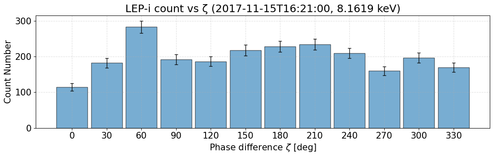
  <figcaption>図11. 16:21:00での8.16 keV帯の各ゼータ角ビンの粒子数と誤差。この時間では粒子数が100を超えていることから、計測誤差は10%を下回る。</figcaption>
</figure>

ここでようやくShoji et al. (2021)のFigure 4の再現ができる。正規化された粒子カウント数の時間変化を以下でプロットする。
```python
import numpy as np
import matplotlib.pyplot as plt
import matplotlib.dates as mdates

time_ax_range_min_lim = np.datetime64('2017-11-15T16:17:00')
time_ax_range_max_lim = np.datetime64('2017-11-15T16:22:00')

energy_i    = 5

gs  = plt.figure(figsize=(10, 6)).add_gridspec(2, 20, hspace=0.05)
ax0 = plt.gcf().add_subplot(gs[0, :19])
ax1 = plt.gcf().add_subplot(gs[1, :19], sharex=ax0)
cax = plt.gcf().add_subplot(gs[:, 19])

ax0.plot(da_B_256Hz_perp_bandpass_amp.time,
         da_B_256Hz_perp_bandpass_amp.data, lw=0.5, c='k')
ax0.set_ylabel(r'$|\delta \mathbf{B}_{\perp}|$' + '\n[nT]')
ax0.set_title(f'energy = {energy_ax[energy_i]:.4f} keV, '
              + r'$125\degree < \alpha < 145\degree$')
ax0.xaxis.set_major_formatter(mdates.DateFormatter('%H:%M:%S'))
ax0.minorticks_on(); ax0.grid(True, which='both', linestyle='--', alpha=0.5)
ax0.set_ylim(0, 10); ax0.set_yticks(np.arange(0, 10.1, 2))
ax0.set_xlim(time_ax_range_min_lim, time_ax_range_max_lim)
ax0.tick_params(labelbottom=False)

da_count    = count_zeta_norm_bin_data_list[energy_i].sel(
    time_center=slice(time_ax_range_min_lim, time_ax_range_max_lim)
)
time        = da_count['time_center'].data
zeta        = da_count['zeta_center'].data          # 0,30,...,330 (12)
count       = da_count.data.T                       # (zeta, time) = (12, Nt)

# --- 周期境界: ζ=0° を ζ=360°としてコピー ---
zeta_wrap   = np.concatenate([zeta, [zeta[0] + 360.0]])   # 0..330, 360 (13)
count_wrap  = np.vstack([count, count[0:1, :]])           # (13, Nt)

count_norm  = count_wrap / np.nanmax(count_wrap)
print(np.nanmax(count_wrap))

# ζ のエッジ（13+1=14 個）
dz          = np.diff(zeta_wrap).mean()
zeta_edges  = np.concatenate([[zeta_wrap[0] - dz/2],
                              (zeta_wrap[:-1] + zeta_wrap[1:]) / 2,
                              [zeta_wrap[-1] + dz/2]])

# 時間エッジ（そのまま）
dt          = np.diff(time).astype('timedelta64[s]').astype(float).mean()
time_edges  = np.concatenate([[time[0] - np.timedelta64(int(dt/2), 's')],
                              time + np.timedelta64(int(dt/2), 's')])

# --- pcolormesh ---
pcm = ax1.pcolormesh(time_edges, zeta_edges, count_norm,
                     cmap='jet', shading='auto',
                     vmin=0.6 * np.nanmax(count_norm), vmax=np.nanmax(count_norm))


# ピーク位置は元の 0..330° だけで計算しておく
count_norm_orig = count / np.nanmax(count)    # (12, Nt)
valid_t = np.any(np.isfinite(count_norm_orig), axis=0)
idx     = np.empty(time.size, dtype=int)
idx[valid_t] = np.nanargmax(count_norm_orig[:, valid_t], axis=0)
ze_peak = zeta[idx[valid_t]]

ax1.scatter(time[valid_t], ze_peak,
            marker='x', s=30, c='k', lw=0.8, zorder=3)

# --- 周期境界（0° → 360°） ---
mask_0 = (ze_peak == 0)
if np.any(mask_0):
    ax1.scatter(time[valid_t][mask_0],
                np.full(np.sum(mask_0), 360.0),
                marker='x', s=30, c='k', lw=0.8, zorder=3)

ax1.set_ylabel(r'$\zeta$' + '\n[deg]')
ax1.xaxis.set_major_formatter(mdates.DateFormatter('%H:%M:%S'))
ax1.minorticks_on(); ax1.grid(True, which='both', linestyle='--', alpha=0.5)
ax1.set_ylim(0, 360)
ax1.set_yticks(np.arange(0, 361, 45))
ax1.set_xlim(time_ax_range_min_lim, time_ax_range_max_lim)

plt.colorbar(pcm, cax=cax)
plt.tight_layout()
plt.show()
```
<figure align="center">
  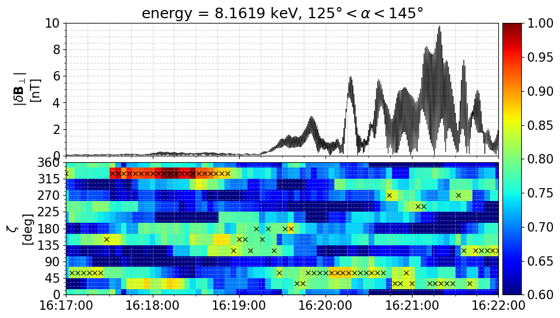
  <figcaption>図12. 垂直擾乱磁場の振幅と、正規化粒子カウント数分布の時間変化を示す。後者では、各時間の最大値を×で示す。なお、こちらは0.45 Hz~0.75 Hzの場合である。Shoji et al. (2021)のFigure 4と同一の0.6 Hz~0.75 HzはFigure 13になる。</figcaption>
</figure>
<figure align="center">
  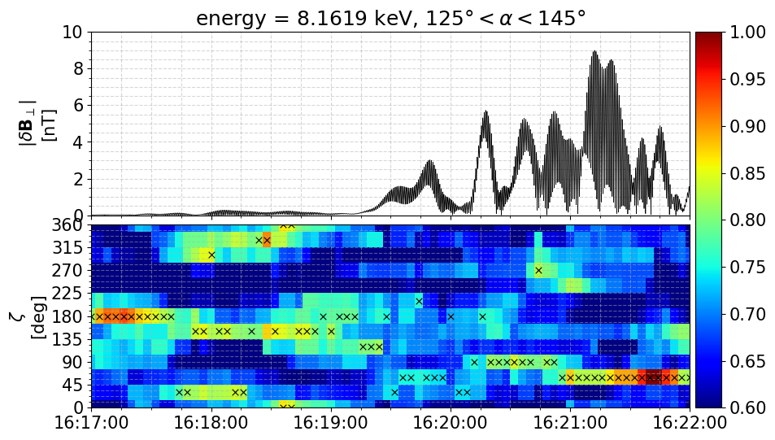
  <figcaption>図13. Shoji et al. (2021)のFigure 4の再現(0.6 Hz~0.75 Hz)。</figcaption>
</figure>
<figure align="center">
  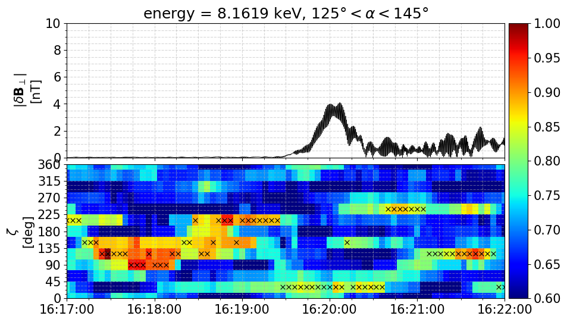
  <figcaption>図13.5. 0.75 Hz~1.00 Hzでの結果。</figcaption>
</figure>
<figure align="center">
  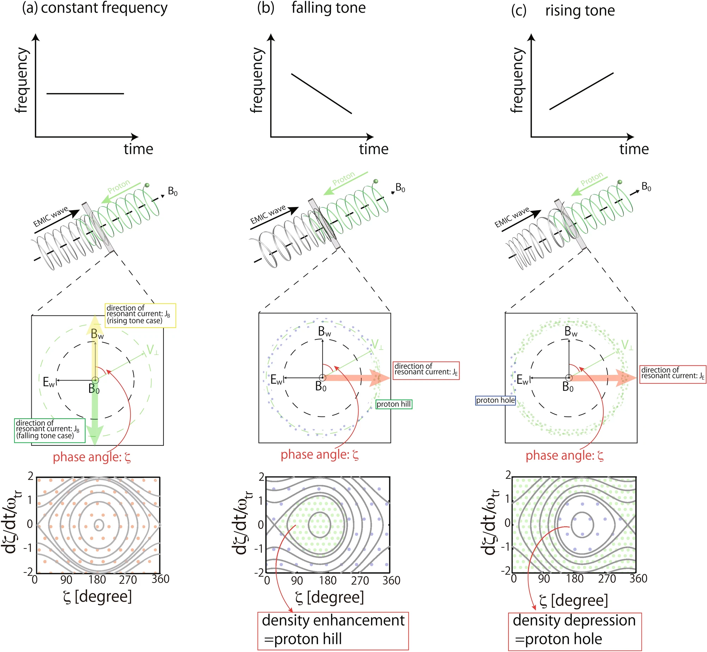
  <figcaption>図14. Schematic illustrations of the nonlinear cyclotron interactions of protons with the EMIC waves that have (a) constant (S = 0), (b) falling (S < 0), and (c) rising (S > 0) frequencies. (According to Figure 1 of Shoji et al. (2021).)</figcaption>
</figure>

図13はShoji et al. (2021)の再現図である。Shoji et al. (2021)ではFluxの図になっているが、式(7)を踏まえると粒子カウント数でも同じ結果になるはずである(が、微妙に異なる)。ただ、結果の傾向は一致しており、もともと $\zeta \approx 180\degree$に粒子は集中していたが、擾乱振幅が大きくなる16:19後半から、$\zeta \approx 45\degree$に集中するようになる。これは、図14に示すように、$\zeta$角が大きい領域でproton holeが形成され、相対的に$\zeta$角が小さい領域に粒子が多くなったと解釈することができる。


### 8. 垂直電場擾乱
粒子カウント数が分かったので、次に $W_{\mathrm{Eint}}$を計算するために、PWE-EFD[^14][^15][^16]で観測した電場 $\mathbf{E}$データをロードする[^10]。ここでは、DSI座標系の`256hz`のデータを使用する。電場はスピン面のみの計測であるため、もう一軸を $\mathbf{E} \cdot \mathbf{B}_{0} = 0$を仮定して算出する。その後、垂直擾乱電場 $\delta \mathbf{E}_{\perp} := \mathbf{E} - \mathbf{B}_{0} \left( \mathbf{E} \cdot \mathbf{B}_{0} \right) / \left| \mathbf{B}_{0} \right|^{2}$ を計算する。その後、磁場と同様にバンドパスフィルタを適用する。
```python
import pyspedas as psp
import ergpyspedas.erg as ergpy
import xarray as xr
import numpy as np

ergpy.pwe_efd(trange=time_range, level='l2', datatype='256hz', coord='dsi')

Ex_256Hz_dsi = psp.get_data('erg_pwe_efd_l2_E256Hz_dsi_Ex_waveform', xarray=True)
Ey_256Hz_dsi = psp.get_data('erg_pwe_efd_l2_E256Hz_dsi_Ey_waveform', xarray=True)

Ex_256Hz_dsi_interp  = Ex_256Hz_dsi.interp(time=B_256Hz_perturb.time)
Ey_256Hz_dsi_interp  = Ey_256Hz_dsi.interp(time=B_256Hz_perturb.time)

Ez_256Hz_dsi_interp  = xr.where(np.abs(B_background_256Hz[:, 2]) > 1E-5, -(Ex_256Hz_dsi_interp * B_background_256Hz[:, 0] + Ey_256Hz_dsi_interp * B_background_256Hz[:, 1]) / B_background_256Hz[:, 2], np.nan)

E_256Hz  = xr.concat(
    [
        Ex_256Hz_dsi_interp,
        Ey_256Hz_dsi_interp,
        Ez_256Hz_dsi_interp
    ],
    dim='xyz'
).transpose('time', 'xyz')

E_256Hz_perp    = E_256Hz - (E_256Hz * B_background_256Hz).sum(dim='xyz') / (B_background_256Hz * B_background_256Hz).sum(dim='xyz') * B_background_256Hz
```
```python
import numpy as np
from scipy.signal import butter, sosfiltfilt
import matplotlib.pyplot as plt
import os # osモジュールもインポートしておく

# フィルタパラメータ
fs = 256.                  # サンプリング周波数 [Hz]
order = 4                 # フィルタの次数
window_sec = background_time_sec        # 背景磁場の移動平均窓幅 [sec]

sos = butter(N=order, Wn=[lowcut, highcut], btype='bandpass', fs=fs, output='sos')

def apply_filter_segmented(y, sos_mat):
    """NaN を含む 1‑D 配列にセグメントごとで sosfiltfilt を適用する"""
    good = np.isfinite(y)
    out  = np.full_like(y, np.nan)
    idx  = np.where(good)[0]
    segs = np.split(idx, np.where(np.diff(idx) != 1)[0] + 1)
    
    # パディング長はフィルタの次数に依存
    # scipyのドキュメントによると、sosfiltfiltのデフォルトpadlenは 3 * (sos.shape[1] // 2 - 1)
    # sosの形状は (n_sections, 6) なので、padlenは 3 * 2 = 6 となる
    padlen = 3 * (sos_mat.shape[1] - 1)
    
    for s in segs:
        if s.size > padlen:
            out[s] = sosfiltfilt(sos_mat, y[s])
    return out

E_256Hz_perp_bandpass = np.zeros(E_256Hz_perp.data.shape) * np.nan  # NaNで初期化
for i in range(3):
    E_256Hz_perp_bandpass[:, i] = apply_filter_segmented(E_256Hz_perp.data[:, i], sos)
da_E_256Hz_perp_bandpass = xr.DataArray(
    E_256Hz_perp_bandpass,
    dims=E_256Hz_perp.dims,
    coords=E_256Hz_perp.coords,
    name='E_256Hz_perp_bandpass'
)

da_E_256Hz_perp_bandpass_amp = np.sqrt((da_E_256Hz_perp_bandpass * da_E_256Hz_perp_bandpass).sum(dim='xyz'))
```
```python
import matplotlib as mpl
import matplotlib.pyplot as plt

mpl.rcdefaults()
mpl.rcParams['font.size'] = 15

time_ax_range_min = np.datetime64('2017-11-15T16:15:00')
time_ax_range_max = np.datetime64('2017-11-15T16:25:00')
fig, ax = plt.subplots(1, 1, figsize=(10, 4), sharex=True)
ax.plot(da_E_256Hz_perp_bandpass_amp.time, da_E_256Hz_perp_bandpass_amp.data, lw=0.5, c='k')
ax.set_ylabel('[mV/m]')
ax.minorticks_on()
ax.grid(True, which='both', linestyle='--', alpha=0.5)
ax.set_xlim(time_ax_range_min, time_ax_range_max)
plt.tight_layout()
plt.show()
```
<figure align="center">
  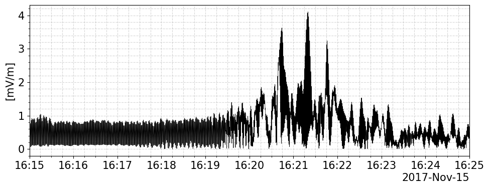
  <figcaption>図15. 0.45-0.75 Hzのバンドパスフィルタを適用した垂直電場擾乱の振幅。</figcaption>
</figure>

### 9. WPIA物理量
速度分布関数 $f \, [\mathrm{m}^{-6} \, \mathrm{s}^{3}]$と粒子計測器で得られるdifferential number flux $J$の間には、次の関係式がある。
$$
\begin{align*}
  f \, [\mathrm{m}^{-6} \, \mathrm{s}^{3}] & = \frac{1}{2} \frac{\left( m \, [\mathrm{kg}] \right)^{2}}{E \, [\mathrm{J}]} J \, [\mathrm{m}^{-2} \, \mathrm{s}^{-1} \, \mathrm{str}^{-1} \, \mathrm{J}^{-1}] \\
  & = \frac{1}{200} \frac{1}{E \, [\mathrm{keV}]} \left( \frac{m \, [\mathrm{kg}]}{e \, [\mathrm{C}]} \right)^{2} J \, [\mathrm{cm}^{-2} \, \mathrm{s}^{-1} \, \mathrm{str}^{-1} \, \mathrm{keV}^{-1}]
\end{align*}
$$
これを用いて、エネルギー交換を評価するための $W_{\mathrm{Eint}}$は、以下のように計算される。
$$
\begin{align*}
  \mathbf{\Omega} &= \left\{ \left( E', \alpha', \zeta \right) \left| E - \frac{\Delta E}{2} \leq E' \leq E + \frac{\Delta E}{2}, \quad \alpha - \frac{\Delta \alpha}{2} \leq \alpha' \leq \alpha + \frac{\Delta \alpha}{2}, \quad 0 \leq \zeta < 2\pi \right. \right\}, \\
  E &= \frac{1}{2} m v^{2}, \quad v \, \mathrm{d}v = \frac{1}{m} \mathrm{d}E, \\
  R \, [\mathrm{s}^{-1}] &= G \, [\mathrm{cm}^{2} \, \mathrm{str} \, \mathrm{keV} \, \mathrm{keV}^{-1}] \, E \, [\mathrm{keV}] \, J \, [\mathrm{cm}^{-2} \, \mathrm{s}^{-1} \, \mathrm{str}^{-1} \, \mathrm{keV}^{-1}],\\
  R \, [\mathrm{s}^{-1}] &= \frac{C}{\tau \, [\mathrm{s}]}, \\
  W_{\mathrm{Eint}} \, [\mathrm{J} \, \mathrm{m}^{-3} \, \mathrm{s}^{-1}] & = \frac{1}{\Delta T} \int^{t + \Delta T / 2}_{t - \Delta T / 2} \mathrm{d}t' \iiint_{\mathbf{\Omega}} \mathrm{d}^{3} \mathbf{v} \left( q \, \delta \mathbf{E}_{\perp} \cdot \mathbf{v} \right) \, f \left( \mathbf{v}, t' \right) \\
  & = \frac{1}{\Delta T} \int^{t + \Delta T / 2}_{t - \Delta T / 2} \mathrm{d}t' \iiint_{\mathbf{\Omega}} \mathrm{d} v \, \mathrm{d} \alpha \, \mathrm{d} \zeta \, v^{2} \sin \alpha \left( - q v \sin \alpha \, \delta E_{\perp} \sin \zeta \right) \, f \left( \mathbf{v}, t' \right) \\
  & = - \frac{q}{\Delta T} \int^{t + \Delta T / 2}_{t - \Delta T / 2} \mathrm{d}t' \iiint_{\mathbf{\Omega}} \mathrm{d} v \, \mathrm{d} \alpha \, \mathrm{d} \zeta \, \delta E_{\perp} v^{3} \sin^{2} \alpha \sin \zeta \, f \left( \mathbf{v}, t' \right) \\
  & = - \frac{q}{\Delta T} \int^{t + \Delta T / 2}_{t - \Delta T / 2} \mathrm{d}t' \iiint_{\mathbf{\Omega}} \mathrm{d} E \, \mathrm{d} \alpha \, \mathrm{d} \zeta \, \delta E_{\perp} \frac{2 E}{m^{2}} \sin^{2} \alpha \sin \zeta \frac{m^{2}}{2 E} \, J \left( E, \alpha, \zeta, t' \right) \\
  & = - \frac{q \, [\mathrm{C}]}{\Delta T \, [\mathrm{s}]} \int^{t + \Delta T / 2}_{t - \Delta T / 2} \mathrm{d}t' \, [\mathrm{s}] \iiint_{\mathbf{\Omega}} \mathrm{d} E \, [\mathrm{J}] \, \mathrm{d} \alpha \, \mathrm{d} \zeta \, \delta E_{\perp} \, [\mathrm{V} \, \mathrm{m}^{-1}] \, \sin^{2} \alpha \sin \zeta \, J \left( E, \alpha, \zeta, t' \right) \, [\mathrm{m}^{-2} \, \mathrm{s}^{-1} \mathrm{str}^{-1} \, \mathrm{J}^{-1}] \\
  & = - 10^{4} \frac{q \, [\mathrm{C}]}{\Delta T \, [\mathrm{s}]} \int^{t + \Delta T / 2}_{t - \Delta T / 2} \mathrm{d}t' \, [\mathrm{s}] \int^{E+\Delta E/2}_{E-\Delta E/2} \mathrm{d} E' \, [\mathrm{keV}] \int^{\alpha + \Delta \alpha/2}_{\alpha - \Delta \alpha/2} \mathrm{d} \alpha' \, \sin^{2} \alpha' \int^{2\pi}_{0} \mathrm{d} \zeta \, \sin \zeta \, \delta E_{\perp} \, [\mathrm{V} \, \mathrm{m}^{-1}] \,  J \left( E', \alpha', \zeta, t' \right) \, [\mathrm{cm}^{-2} \, \mathrm{s}^{-1} \mathrm{str}^{-1} \, \mathrm{keV}^{-1}], \\
  W_{\mathrm{Eint}} \, [\mathrm{keV} \, \mathrm{m}^{-3} \, \mathrm{s}^{-1}] &= - 10 \frac{q}{e} \frac{1}{\Delta T} \int^{t + \Delta T / 2}_{t - \Delta T / 2} \mathrm{d}t' \, \int^{E+\Delta E/2}_{E-\Delta E/2} \mathrm{d} E' \, \int^{\alpha + \Delta \alpha/2}_{\alpha - \Delta \alpha/2} \mathrm{d} \alpha' \sin^{2} \alpha' \int^{2\pi}_{0} \mathrm{d} \zeta \sin \zeta \, \delta E_{\perp} \, J \\
  &= -10 \frac{q}{e} \int^{E+\Delta E/2}_{E-\Delta E/2} \mathrm{d} E' \frac{1}{E'} \int^{\alpha + \Delta \alpha/2}_{\alpha - \Delta \alpha/2} \mathrm{d} \alpha' \sin^{2} \alpha' \int^{2\pi}_{0} \mathrm{d} \zeta \sin \zeta \frac{1}{\Delta T} \int^{t + \Delta T / 2}_{t - \Delta T / 2} \mathrm{d}t' \, \delta E_{\perp} \, \frac{R \, [\mathrm{s}^{-1}]}{G \, [\mathrm{cm}^{2} \, \mathrm{str} \, \mathrm{keV} \, \mathrm{keV}^{-1}]} \\
  & \approx - 10 \frac{q}{e} \frac{\Delta E}{E} \Delta \alpha \sum_{\zeta} \left\{ \Delta \zeta \sin \zeta \left( \sum_{i} w_{i} \right)^{-1} \left( \sum_{i} \frac{\delta E_{\perp i} C_{i} w_{i}}{\tau \, [\mathrm{s}] \, G} \sin^{2} \alpha_{i} \right) \right\},
\end{align*}
$$
$$
W_{\mathrm{Eint}} \left( E, \alpha, t \right) \, [\mathrm{keV} \, \mathrm{m}^{-3} \, \mathrm{s}^{-1}] = - \frac{10^{-2}}{\tau \, [\mathrm{s}]} \frac{q}{e} \frac{\Delta E}{E} \Delta \alpha \sum_{\zeta} \left\{ \Delta \zeta \sin \zeta \left( \sum_{i} w_{i} \right)^{-1} \left( \sum_{i} \frac{\delta E_{\perp i} \, [\mathrm{mV} \, \mathrm{m}^{-1}] \, C_{i} w_{i}}{G \, [\mathrm{cm}^{2} \, \mathrm{str} \, \mathrm{keV} \, \mathrm{keV}^{-1}]} \sin^{2} \alpha_{i} \right) \right\}. \tag{9}
$$
ここで、$R$は粒子カウントレートであり、$w$は式(8)で与えられるような粒子カウント数を $\zeta$ビンに分配する際の重みであり、$\sum_{i} w_{i}$はoccurenceになる。対象時間内で得られたoccurenceで割ることで、時間平均の意味を持たせる。同様にして、EMICの周波数変化を評価するための $W_{\mathrm{Bint}}$は以下のように計算される。
$$
W_{\mathrm{Bint}} \, [\mathrm{J} \, \mathrm{m}^{-4}] = \frac{1}{\Delta T} \int^{t + \Delta T / 2}_{t - \Delta T / 2} \mathrm{d}t' \iiint_{\mathbf{\Omega}} \mathrm{d}^{3} \mathbf{v} \left( q \, \delta \mathbf{B}_{\perp} \cdot \mathbf{v} \right) \, f \left( \mathbf{v}, t' \right),
$$
$$
W_{\mathrm{Bint}} \left( E, \alpha, t \right) \, [\mathrm{keV} \, \mathrm{m}^{-4}] \approx \frac{10^{-8}}{\tau \, [\mathrm{s}]} \frac{q}{e} \frac{\Delta E}{E} \Delta \alpha \sum_{\zeta} \left\{ \Delta \zeta \cos \zeta \left( \sum_{i} w_{i} \right)^{-1} \left( \sum_{i} \frac{\delta B_{\perp i} \, [\mathrm{nT}] \, C_{i} w_{i}}{G \, [\mathrm{cm}^{2} \, \mathrm{str} \, \mathrm{keV} \, \mathrm{keV}^{-1}]} \sin^{2} \alpha_{i} \right) \right\}. \tag{10}
$$

計算の前に、$\sum$の中の物理量 (modified count[^4])
$$
\frac{\delta E_{\perp i} \, [\mathrm{mV} \, \mathrm{m}^{-1}] \, C_{i} w_{i}}{G \, [\mathrm{cm}^{2} \, \mathrm{str} \, \mathrm{keV} \, \mathrm{keV}^{-1}]} \sin^{2} \alpha_{i} \times 10^{-2} \frac{q}{e} \, [\mathrm{keV} \, \mathrm{m}^{-3} \, \mathrm{rad}^{-2}], \quad \frac{\delta B_{\perp i} \, [\mathrm{nT}] \, C_{i} w_{i}}{G \, [\mathrm{cm}^{2} \, \mathrm{str} \, \mathrm{keV} \, \mathrm{keV}^{-1}]} \sin^{2} \alpha_{i} \times 10^{-8} \frac{q}{e} \, [\mathrm{keV} \, \mathrm{m}^{-4} \, \mathrm{s} \, \mathrm{rad}^{-2}]
$$
をplotしてみる。
```python
modified_count_E_pitch_zeta_data_list = {}
modified_count_B_pitch_zeta_data_list = {}

for energy_i in range(energy_num):
    for channel_i in range(channel_num):
        data_       = count_pitch_zeta_data_list[energy_i, channel_i]

        count_      = data_[:, 0]
        alpha_      = np.deg2rad(data_[:, 1])   # [rad]
        zeta_       = np.deg2rad(data_[:, 2])   # [rad]
        energy_     = energy_ax[energy_i]       # [keV]
        G_Factor_   = G_Factor_func(energy_)    # [cm^2 str keV keV^-1]

        Eperp_      = da_E_256Hz_perp_bandpass.interp(time=count_.time) * 1E-3  # [V/m]
        Eperp_2_    = (Eperp_ * Eperp_).sum(dim='xyz')
        Bperp_      = da_B_256Hz_perp_bandpass.interp(time=count_.time) * 1E-9  # [T]
        Bperp_2_    = (Bperp_ * Bperp_).sum(dim='xyz')

        count_E_    = np.sqrt(Eperp_2_) * count_ / G_Factor_ * np.sin(alpha_.data)**2E0 * 1E1   # [keV m-3 rad-2]
        count_B_    = np.sqrt(Bperp_2_) * count_ / G_Factor_ * np.sin(alpha_.data)**2E0 * 1E1   # [keV m-4 s rad-2]

        da_E_ = xr.concat(
            [
                count_E_,
                data_[:, 1],
                data_[:, 2]
            ],
            dim='variable'
        ).assign_coords(variable=['modified_count_E', 'pitch_angle_deg','zeta_angle_deg']).transpose('time','variable')

        da_B_ = xr.concat(
            [
                count_B_,
                data_[:, 1],
                data_[:, 2]
            ],
            dim='variable'
        ).assign_coords(variable=['modified_count_B', 'pitch_angle_deg','zeta_angle_deg']).transpose('time','variable')

        modified_count_E_pitch_zeta_data_list[energy_i, channel_i] = da_E_.assign_coords(
            channel=channel_ax[channel_i],
            energy_keV=energy_ax[energy_i],
        )
        print(modified_count_E_pitch_zeta_data_list[energy_i, channel_i][900:910, :])

        modified_count_B_pitch_zeta_data_list[energy_i, channel_i] = da_B_.assign_coords(
            channel=channel_ax[channel_i],
            energy_keV=energy_ax[energy_i],
        )
        print(modified_count_B_pitch_zeta_data_list[energy_i, channel_i][900:910, :])
```
```python
import numpy as np
import matplotlib.pyplot as plt
import matplotlib.dates as mdates
import matplotlib.colors as mcolors
import matplotlib.cm as cm
import matplotlib as mpl

mpl.rcdefaults()
mpl.rcParams['font.size'] = 15

time_ax_range_min = np.datetime64('2017-11-15T16:15:00')
time_ax_range_max = np.datetime64('2017-11-15T16:25:00')

for energy_i in range(energy_num):
    if energy_i != 5:
        continue

    # --- 1) 全channelでvmin/vmaxを決める（>0 かつ有限のみ） ---
    count_vals = []
    alpha_vals = []
    for channel_i in range(channel_num):
        d = modified_count_E_pitch_zeta_data_list[energy_i, channel_i].sel(time=slice(time_ax_range_min, time_ax_range_max))
        f = d.sel(variable='modified_count_E').values
        alpha = d.sel(variable='pitch_angle_deg').values
        count_vals.append(f.ravel())
        alpha_vals.append(alpha.ravel())
    count_all = np.concatenate(count_vals)
    alpha_all = np.concatenate(alpha_vals)
    mask = np.isfinite(count_all) & (alpha_all > 125) & (alpha_all < 145)
    if not mask.any():
        continue
    vmin, vmax = np.nanpercentile(count_all[mask], 5), np.nanpercentile(count_all[mask], 95)
    vmax_plus = np.nanmax([np.abs(vmin), np.abs(vmax)])
    norm = mcolors.LogNorm(vmin=vmin, vmax=vmax_plus)
    cmap = 'turbo'

    # --- 2) 描画 ---
    fig = plt.figure(figsize=(10, 12))
    ax0 = fig.add_subplot(211)
    ax1 = fig.add_subplot(212)

    for channel_i in range(channel_num):
        d = modified_count_E_pitch_zeta_data_list[energy_i, channel_i].sel(time=slice(time_ax_range_min, time_ax_range_max))
        t = d['time'].values
        count = d.sel(variable='modified_count_E').values
        alpha = d.sel(variable='pitch_angle_deg').values
        zeta  = d.sel(variable='zeta_angle_deg').values
        mask = np.isfinite(count) & (alpha > 125) & (alpha < 145)
        t   = t[mask]
        count   = count[mask]
        alpha   = alpha[mask]
        zeta    = zeta[mask]
        ax0.scatter(t, alpha, c=count, s=10, cmap=cmap, norm=norm, rasterized=True)
        ax1.scatter(t, zeta,  c=count, s=10, cmap=cmap, norm=norm, rasterized=True)

    # 軸体裁
    ax0.set_ylabel(r'Pitch Angle $\alpha$' + '\n[deg]')
    ax1.set_ylabel(r'Phase difference $\zeta$' + '\n[deg]')

    ax0.set_title(f'LEP-i modified count number for E (energy = {energy_ax[energy_i]:.4f} keV)')
    for ax in (ax0, ax1):
        ax.xaxis.set_major_formatter(mdates.DateFormatter('%H:%M'))
        ax.minorticks_on()
        ax.grid(True, which='both', linestyle='--', alpha=0.5)
        ax.set_xlim(time_ax_range_min, time_ax_range_max)
    ax0.set_ylim(0, 180);  ax0.set_yticks(np.arange(0, 181, 10))
    ax1.set_ylim(0, 360);  ax1.set_yticks(np.arange(0, 361, 30))

    # --- 3) カラーバーは共通norm/cmapから作る ---
    sm = cm.ScalarMappable(norm=norm, cmap=cmap)
    sm.set_array([])  # 必須
    plt.colorbar(sm, ax=ax0, label='Modified count ' + r'[$\mathrm{keV} \, \mathrm{m}^{-3} \, \mathrm{rad}^{-2}$]')
    plt.colorbar(sm, ax=ax1, label='Modified count ' + r'[$\mathrm{keV} \, \mathrm{m}^{-3} \, \mathrm{rad}^{-2}$]')

    plt.tight_layout()
    plt.show()
```

<figure align="center">
  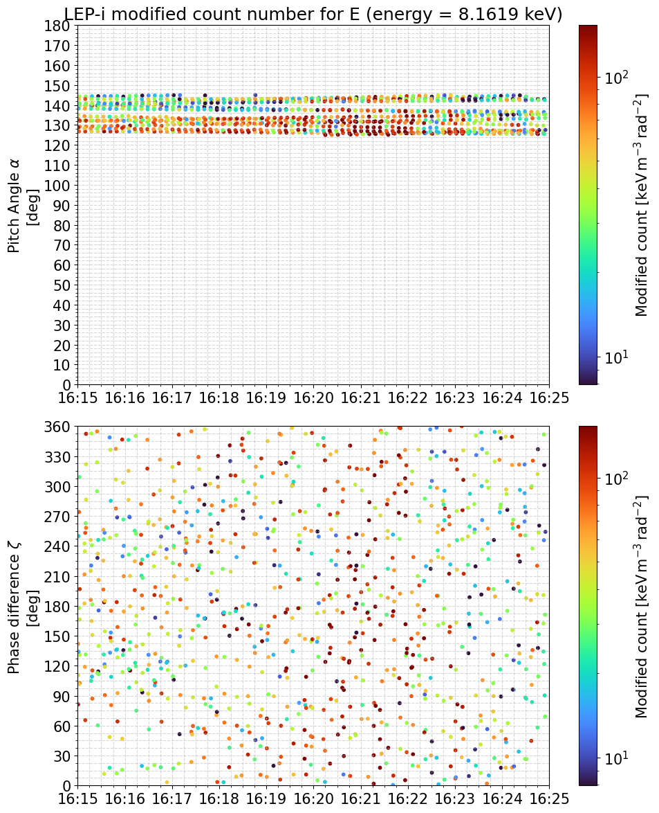
  <figcaption>図16. 8.16 keV帯の陽子の電場修正粒子カウント数の散布図。プロットは観測で注目するピッチ角125°‒145°に制限した。</figcaption>
</figure>

```python
import numpy as np
import matplotlib.pyplot as plt
import matplotlib.dates as mdates
import matplotlib.colors as mcolors
import matplotlib.cm as cm
import matplotlib as mpl

mpl.rcdefaults()
mpl.rcParams['font.size'] = 15

time_ax_range_min = np.datetime64('2017-11-15T16:15:00')
time_ax_range_max = np.datetime64('2017-11-15T16:25:00')

for energy_i in range(energy_num):
    if energy_i != 5:
        continue

    # --- 1) 全channelでvmin/vmaxを決める（>0 かつ有限のみ） ---
    count_vals = []
    alpha_vals = []
    for channel_i in range(channel_num):
        d = modified_count_B_pitch_zeta_data_list[energy_i, channel_i].sel(time=slice(time_ax_range_min, time_ax_range_max))
        f = d.sel(variable='modified_count_B').values
        alpha = d.sel(variable='pitch_angle_deg').values
        count_vals.append(f.ravel())
        alpha_vals.append(alpha.ravel())
    count_all = np.concatenate(count_vals)
    alpha_all = np.concatenate(alpha_vals)
    mask = np.isfinite(count_all) & (alpha_all > 125) & (alpha_all < 145)
    if not mask.any():
        continue
    vmin, vmax = np.nanpercentile(count_all[mask], 5), np.nanpercentile(count_all[mask], 95)
    vmax_plus = np.nanmax([np.abs(vmin), np.abs(vmax)])
    norm = mcolors.LogNorm(vmin=vmin, vmax=vmax_plus)
    cmap = 'turbo'

    # --- 2) 描画 ---
    fig = plt.figure(figsize=(10, 12))
    ax0 = fig.add_subplot(211)
    ax1 = fig.add_subplot(212)

    for channel_i in range(channel_num):
        d = modified_count_B_pitch_zeta_data_list[energy_i, channel_i].sel(time=slice(time_ax_range_min, time_ax_range_max))
        t = d['time'].values
        count = d.sel(variable='modified_count_B').values
        alpha = d.sel(variable='pitch_angle_deg').values
        zeta  = d.sel(variable='zeta_angle_deg').values
        mask = np.isfinite(count) & (alpha > 125) & (alpha < 145)
        t   = t[mask]
        count   = count[mask]
        alpha   = alpha[mask]
        zeta    = zeta[mask]
        ax0.scatter(t, alpha, c=count, s=10, cmap=cmap, norm=norm, rasterized=True)
        ax1.scatter(t, zeta,  c=count, s=10, cmap=cmap, norm=norm, rasterized=True)

    # 軸体裁
    ax0.set_ylabel(r'Pitch Angle $\alpha$' + '\n[deg]')
    ax1.set_ylabel(r'Phase difference $\zeta$' + '\n[deg]')

    ax0.set_title(f'LEP-i modified count number for B (energy = {energy_ax[energy_i]:.4f} keV)')
    for ax in (ax0, ax1):
        ax.xaxis.set_major_formatter(mdates.DateFormatter('%H:%M'))
        ax.minorticks_on()
        ax.grid(True, which='both', linestyle='--', alpha=0.5)
        ax.set_xlim(time_ax_range_min, time_ax_range_max)
    ax0.set_ylim(0, 180);  ax0.set_yticks(np.arange(0, 181, 10))
    ax1.set_ylim(0, 360);  ax1.set_yticks(np.arange(0, 361, 30))

    # --- 3) カラーバーは共通norm/cmapから作る ---
    sm = cm.ScalarMappable(norm=norm, cmap=cmap)
    sm.set_array([])  # 必須
    plt.colorbar(sm, ax=ax0, label='Modified count ' + r'[$\mathrm{keV} \, \mathrm{s} \, \mathrm{m}^{-4} \, \mathrm{rad}^{-2}$]')
    plt.colorbar(sm, ax=ax1, label='Modified count ' + r'[$\mathrm{keV} \, \mathrm{s} \, \mathrm{m}^{-4} \, \mathrm{rad}^{-2}$]')

    plt.tight_layout()
    plt.show()
```

<figure align="center">
  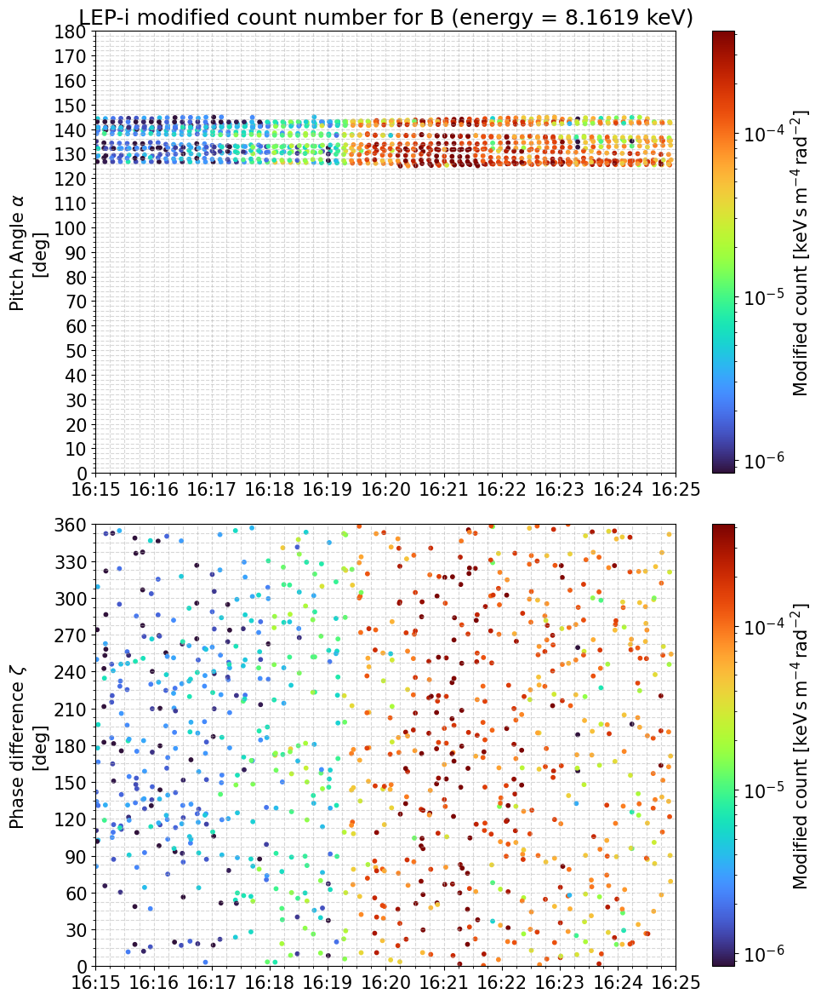
  <figcaption>図16. 8.16 keV帯の陽子の磁場修正粒子カウント数の散布図。プロットは観測で注目するピッチ角125°‒145°に制限した。</figcaption>
</figure>

図15と図16を見ると、確かに波の振幅が大きくなる16:20付近で値が大きくなる様子が確認できる。修正粒子カウント数では $\sin \zeta$のような $\zeta$分布の影響が含まれていない。実際に $W_{\mathrm{Eint}}$と $W_{\mathrm{Bint}}$を計算してみる。

まず、$\Delta E / E$を計算しておく。
```python
energy_center   = energy_ax[1:]

log_center = np.log10(energy_center)
log_edges = np.zeros(len(energy_center) + 1)
log_edges[1:-1] = 0.5 * (log_center[:-1] + log_center[1:])
log_edges[0] = log_center[0] + (log_center[0] - log_edges[1])
log_edges[-1] = log_center[-1] - (log_edges[-2] - log_center[-1])

energy_grid = 10**log_edges

energy_width = np.zeros(len(energy_center))
energy_width = energy_grid[0:-1] - energy_grid[1:]

energy_width_center = energy_width / energy_center
energy_width
```

次に、$\sum_{i}$の計算を行う。電場、磁場それぞれで関数を定義。
```python
import numpy as np
import xarray as xr

def make_weighted_zeta_counts_for_energy_periodic_avg_sin(
    count_pitch_zeta_data_list,
    count_variable_name,
    energy_i,
    channel_num,
    time_start,
    time_end,
    T_integrate=60.0,      # [s]
    step_sec=4.0,          # [s]
    alpha_min=125.0,
    alpha_max=145.0,
    zeta_bin_width=30.0    # [deg]
):
    """
    1エネルギーチャンネルについて、ピッチ角 α∈[alpha_min, alpha_max] の
    カウントを ζ ビン(0,30,...,330)に重み付きで分配し、
    各ビンごとに [Σ(C * weight) / Σ(weight)] を返す（ζ は周期境界）。
    """

    # ζ グリッド（ビン中心）
    zeta_centers = np.arange(0., 360.0, zeta_bin_width)  # 0,30,...,330
    n_bins       = zeta_centers.size

    # 時間中心 tc のリスト
    time_start = np.datetime64(time_start)
    time_end   = np.datetime64(time_end)
    tc_list = np.arange(
        time_start,
        time_end + np.timedelta64(1, "s"),
        np.timedelta64(int(step_sec), "s")
    ).astype("datetime64[ns]")

    # 積分時間の半分
    T_half = np.timedelta64(int(T_integrate / 2), "s")

    # 出力配列 (tc, zeta_bin)
    num_tc_zeta = np.zeros((tc_list.size, n_bins), dtype=float)  # Σ(C * weight)
    den_tc_zeta = np.zeros((tc_list.size, n_bins), dtype=float)  # Σ(weight)

    for itc, tc in enumerate(tc_list):
        t0 = tc - T_half
        t1 = tc + T_half

        for ch in range(channel_num):
            d = count_pitch_zeta_data_list[energy_i, ch].sel(time=slice(t0, t1))
            if d.time.size == 0:
                continue

            count = d.sel(variable=count_variable_name).values
            alpha = d.sel(variable="pitch_angle_deg").values
            zeta  = d.sel(variable="zeta_angle_deg").values

            # 有効データ & α 範囲
            mask = (
                np.isfinite(count)
                & np.isfinite(alpha)
                & np.isfinite(zeta)
                & (alpha >= alpha_min)
                & (alpha <= alpha_max)
            )
            if not mask.any():
                continue

            c = count[mask].ravel()
            a = alpha[mask].ravel()
            z = zeta[mask].ravel()

            # ---- 周期境界つき ζ 線形分配 ----
            # [0, 360) に折りたたみ
            z_mod = np.mod(z, 360.0)

            # 左のビン中心 index (0..n_bins-1)
            i0 = np.floor(z_mod / zeta_bin_width).astype(int)
            i0 = np.clip(i0, 0, n_bins - 1)

            # 右のビン中心（周期境界）
            i1 = (i0 + 1) % n_bins

            # 左の中心角 ζ0
            z0 = zeta_centers[i0]
            z1 = zeta_centers[i1]
            dz = zeta_bin_width  # Δζ は一定

            # 線形重み
            w1 = ((z_mod - z0) / dz)
            w0 = (1.0 - w1)

            # 分子: Σ(C * weight)
            np.add.at(num_tc_zeta[itc], i0, c * w0 * np.sin(np.deg2rad(z0)) * np.deg2rad(dz))
            np.add.at(num_tc_zeta[itc], i1, c * w1 * np.sin(np.deg2rad(z1)) * np.deg2rad(dz))

            # 分母: Σ(weight)
            np.add.at(den_tc_zeta[itc], i0, w0)
            np.add.at(den_tc_zeta[itc], i1, w1)
            # ---- ここまで ----

    # 重み付き平均 × T_integrate
    with np.errstate(invalid='ignore', divide='ignore'):
        counts_tc_zeta = (num_tc_zeta / den_tc_zeta)

    da = xr.DataArray(
        counts_tc_zeta,
        coords={
            "time_center": tc_list,
            "zeta_center": zeta_centers,
        },
        dims=("time_center", "zeta_center"),
        name="count_weighted_avg",
        attrs={
            "T_integrate_sec": T_integrate,
            "step_sec": step_sec,
            "alpha_min": alpha_min,
            "alpha_max": alpha_max,
            "zeta_bin_width_deg": zeta_bin_width,
        },
    )
    return da
```
```python
import numpy as np
import xarray as xr

def make_weighted_zeta_counts_for_energy_periodic_avg_cos(
    count_pitch_zeta_data_list,
    count_variable_name,
    energy_i,
    channel_num,
    time_start,
    time_end,
    T_integrate=60.0,      # [s]
    step_sec=4.0,          # [s]
    alpha_min=125.0,
    alpha_max=145.0,
    zeta_bin_width=30.0    # [deg]
):
    """
    1エネルギーチャンネルについて、ピッチ角 α∈[alpha_min, alpha_max] の
    カウントを ζ ビン(0,30,...,330)に重み付きで分配し、
    各ビンごとに [Σ(C * weight) / Σ(weight)] を返す（ζ は周期境界）。
    """

    # ζ グリッド（ビン中心）
    zeta_centers = np.arange(0., 360.0, zeta_bin_width)  # 0,30,...,330
    n_bins       = zeta_centers.size

    # 時間中心 tc のリスト
    time_start = np.datetime64(time_start)
    time_end   = np.datetime64(time_end)
    tc_list = np.arange(
        time_start,
        time_end + np.timedelta64(1, "s"),
        np.timedelta64(int(step_sec), "s")
    ).astype("datetime64[ns]")

    # 積分時間の半分
    T_half = np.timedelta64(int(T_integrate / 2), "s")

    # 出力配列 (tc, zeta_bin)
    num_tc_zeta = np.zeros((tc_list.size, n_bins), dtype=float)  # Σ(C * weight)
    den_tc_zeta = np.zeros((tc_list.size, n_bins), dtype=float)  # Σ(weight)

    for itc, tc in enumerate(tc_list):
        t0 = tc - T_half
        t1 = tc + T_half

        for ch in range(channel_num):
            d = count_pitch_zeta_data_list[energy_i, ch].sel(time=slice(t0, t1))
            if d.time.size == 0:
                continue

            count = d.sel(variable=count_variable_name).values
            alpha = d.sel(variable="pitch_angle_deg").values
            zeta  = d.sel(variable="zeta_angle_deg").values

            # 有効データ & α 範囲
            mask = (
                np.isfinite(count)
                & np.isfinite(alpha)
                & np.isfinite(zeta)
                & (alpha >= alpha_min)
                & (alpha <= alpha_max)
            )
            if not mask.any():
                continue

            c = count[mask].ravel()
            a = alpha[mask].ravel()
            z = zeta[mask].ravel()

            # ---- 周期境界つき ζ 線形分配 ----
            # [0, 360) に折りたたみ
            z_mod = np.mod(z, 360.0)

            # 左のビン中心 index (0..n_bins-1)
            i0 = np.floor(z_mod / zeta_bin_width).astype(int)
            i0 = np.clip(i0, 0, n_bins - 1)

            # 右のビン中心（周期境界）
            i1 = (i0 + 1) % n_bins

            # 左の中心角 ζ0
            z0 = zeta_centers[i0]
            z1 = zeta_centers[i1]
            dz = zeta_bin_width  # Δζ は一定

            # 線形重み
            w1 = ((z_mod - z0) / dz)
            w0 = (1.0 - w1)

            # 分子: Σ(C * weight)
            np.add.at(num_tc_zeta[itc], i0, c * w0 * np.cos(np.deg2rad(z0)) * np.deg2rad(dz))
            np.add.at(num_tc_zeta[itc], i1, c * w1 * np.cos(np.deg2rad(z1)) * np.deg2rad(dz))

            # 分母: Σ(weight)
            np.add.at(den_tc_zeta[itc], i0, w0)
            np.add.at(den_tc_zeta[itc], i1, w1)
            # ---- ここまで ----

    # 重み付き平均 × T_integrate
    with np.errstate(invalid='ignore', divide='ignore'):
        counts_tc_zeta = (num_tc_zeta / den_tc_zeta)

    da = xr.DataArray(
        counts_tc_zeta,
        coords={
            "time_center": tc_list,
            "zeta_center": zeta_centers,
        },
        dims=("time_center", "zeta_center"),
        name="count_weighted_avg",
        attrs={
            "T_integrate_sec": T_integrate,
            "step_sec": step_sec,
            "alpha_min": alpha_min,
            "alpha_max": alpha_max,
            "zeta_bin_width_deg": zeta_bin_width,
        },
    )
    return da
```

各エネルギー帯で計算。
```python
WEint_energy_list   = {}
WBint_energy_list   = {}

alpha_min_deg   = 125.0
alpha_max_deg   = 145.0
delta_alpha_rad = np.deg2rad(alpha_max_deg - alpha_min_deg)

for energy_i in range(energy_num):
    if energy_i == 0:
        continue
    da_weighted_E = make_weighted_zeta_counts_for_energy_periodic_avg_sin(
        modified_count_E_pitch_zeta_data_list,
        count_variable_name='modified_count_E',
        energy_i=energy_i,
        channel_num=channel_num,
        time_start=np.datetime64('2017-11-15T16:15:00'),
        time_end=np.datetime64('2017-11-15T16:25:00'),
        T_integrate=60.0,
        step_sec=4.0,
        alpha_min=125.0,
        alpha_max=145.0,
        zeta_bin_width=30.
    )
    #print(da_weighted_E)
    da_WE = xr.DataArray(
        (- da_weighted_E.sum('zeta_center') * delta_alpha_rad).data * energy_width[energy_i - 1] / energy_center[energy_i - 1] / sampling_time,
        dims=['time'],
        coords={'time': da_weighted_E.time_center.data,
                'energy_center_keV': energy_center[energy_i - 1],
                'energy_width':      energy_width[energy_i - 1]},
        name=f'W_Eint_per_energy_{energy_i}'
    )
    WEint_energy_list[energy_i] = da_WE # [keV m-3 s-1]

    da_weighted_B = make_weighted_zeta_counts_for_energy_periodic_avg_cos(
        modified_count_B_pitch_zeta_data_list,
        count_variable_name='modified_count_B',
        energy_i=energy_i,
        channel_num=channel_num,
        time_start=np.datetime64('2017-11-15T16:15:00'),
        time_end=np.datetime64('2017-11-15T16:25:00'),
        T_integrate=60.0,
        step_sec=4.0,
        alpha_min=125.0,
        alpha_max=145.0,
        zeta_bin_width=30.
    )
    print(da_weighted_B[75:80, :])
    da_WB = xr.DataArray(
        (da_weighted_B.sum('zeta_center') * delta_alpha_rad).data * energy_width[energy_i - 1] / energy_center[energy_i - 1] / sampling_time,
        dims=['time'],
        coords={'time': da_weighted_B.time_center.data,
                'energy_center_keV': energy_center[energy_i - 1],
                'energy_width':      energy_width[energy_i - 1]},
        name=f'W_Bint_per_energy_{energy_i}'
    )
    WBint_energy_list[energy_i]  = da_WB   # [keV m^-4]
```

エネルギー帯ごとの配列を、一つの配列に統合する。
```python
W_Eint_all = xr.concat(list(WEint_energy_list.values()), dim='energy_center_keV')
W_Bint_all = xr.concat(list(WBint_energy_list.values()), dim='energy_center_keV')

print(W_Eint_all[:, 75:80])
print('')
print(W_Bint_all[:, 75:80])
```

結果をプロットする。
```python
import numpy as np
import xarray as xr
import matplotlib.pyplot as plt
import matplotlib.dates as mdates

def plot_W_on_ax(ax, W_all, energy_range=None, time_range=None,
                 cmap="turbo", normalize=True, vlim=None,
                 title=None, ylabel="Energy [keV]", cbar_title=None, cax=None):
    Wa = W_all

    # --- energy 範囲: 降順でも動くようにブール抽出 ---
    if energy_range is not None:
        el, eh = energy_range
        ec = Wa.coords["energy_center_keV"].values
        mask = (ec >= min(el, eh)) & (ec <= max(el, eh))
        Wa = Wa.isel(energy_center_keV=mask)

    # --- time 範囲 ---
    if time_range is not None:
        t0, t1 = np.datetime64(time_range[0]), np.datetime64(time_range[1])
        Wa = Wa.sel(time=slice(t0, t1))

    if Wa.size == 0:
        raise ValueError("指定範囲内にデータが存在しない")

    # --- energy 昇順に並べ替え ---
    e = Wa.energy_center_keV.values
    order = np.argsort(e)
    e = e[order]
    Wa = Wa.isel(energy_center_keV=order)

    # --- energy エッジ（対数） ---
    loge = np.log10(e)
    loge_edge = np.empty(e.size + 1)
    loge_edge[1:-1] = 0.5 * (loge[:-1] + loge[1:])
    loge_edge[0]    = loge[0]  + (loge[0]  - loge_edge[1])
    loge_edge[-1]   = loge[-1] - (loge_edge[-2] - loge[-1])
    e_edge = 10**loge_edge

    # --- time エッジ ---
    t = Wa.time.values
    t_num = mdates.date2num(t.astype("datetime64[ms]").astype(object))
    if t_num.size == 1:
        dt = 1/24/60
        t_edge = np.array([t_num[0]-dt/2, t_num[0]+dt/2])
    else:
        t_edge = np.empty(t_num.size + 1)
        t_edge[1:-1] = 0.5*(t_num[:-1] + t_num[1:])
        t_edge[0]    = t_num[0]  - (t_edge[1]  - t_num[0])
        t_edge[-1]   = t_num[-1] + (t_num[-1] - t_edge[-2])

    Z = Wa.values

    # --- 正規化 or vlim ---
    if normalize:
        if vlim is None:
            vmax = np.nanmax(np.abs(Z)) or 1.0
            Z = Z / vmax
            vmin, vmax_plot = -1, 1
        else:
            vmax = np.nanmax(np.abs(Z)) or 1.0
            Z = Z / vmax
            vmin, vmax_plot = vlim
    else:
        if vlim is None:
            vmax_plot = np.nanmax(np.abs(Z)) or 1.0
            vmin = -vmax_plot
        else:
            vmin, vmax_plot = vlim

    pcm = ax.pcolormesh(t_edge, e_edge, Z, shading="auto",
                        cmap=cmap, vmin=vmin, vmax=vmax_plot)
    ax.set_yscale("log")
    ax.set_ylabel(ylabel)
    ax.minorticks_on()
    ax.grid(True, which='both', linestyle='--', alpha=0.5)
    ax.xaxis.set_major_locator(mdates.MinuteLocator(interval=1))
    ax.xaxis.set_major_formatter(mdates.DateFormatter("%H:%M"))
    if title: ax.set_title(title)
    if cax is not None:
        cb = plt.colorbar(pcm, cax=cax)
        if cbar_title: cb.set_label(cbar_title)
    return pcm
```
```python
import matplotlib.dates as mdates
from matplotlib.colors import LogNorm

fig = plt.figure(figsize=(10, 8), constrained_layout=False)
gs  = fig.add_gridspec(nrows=4, ncols=2, width_ratios=[1, 0.015],
                       wspace=0.025, hspace=0.1)

ax0  = fig.add_subplot(gs[0, 0])
ax1  = fig.add_subplot(gs[1, 0], sharex=ax0)
ax2  = fig.add_subplot(gs[2, 0], sharex=ax0)
ax3  = fig.add_subplot(gs[3, 0], sharex=ax0)
cax0 = fig.add_subplot(gs[0, 1])
cax2 = fig.add_subplot(gs[2, 1])
cax3 = fig.add_subplot(gs[3, 1])

ax0.tick_params(labelbottom=False)
ax1.tick_params(labelbottom=False)
ax2.tick_params(labelbottom=False)

tmin = np.datetime64('2017-11-15T16:15:00')
tmax = np.datetime64('2017-11-15T16:25:00')

tE = da_E_256Hz_perp_bandpass_amp.time.values.astype('datetime64[ms]').astype(object)
TIME, FREC = np.meshgrid(ds_spec_B_256Hz_z.time, ds_spec_B_256Hz_z.freq)
pcm = ax0.pcolormesh(TIME, FREC, ds_spec_B_256Hz_z.Sxx_Bz.T, cmap='jet', norm=LogNorm(vmin=1E-4, vmax=1E2), shading='auto')
ax0.set_ylabel(r'$B_{z}$ (DSI) Freq.' + '\n[Hz]')
ax0.minorticks_on()
ax0.set_ylim(0.4, 1.0)
ax0.grid(True, which='both', linestyle='--', alpha=0.5)
cb = plt.colorbar(pcm, cax=cax0)
cb.set_label(r'[$\mathrm{nT}^{2} / \mathrm{Hz}$]')

tB = da_B_256Hz_perp_bandpass_amp.time.values.astype('datetime64[ms]').astype(object)
ax1.plot(mdates.date2num(tB), da_B_256Hz_perp_bandpass_amp.data, lw=0.5, c='k')
ax1.set_ylabel(r'$|\mathbf{B}_{\mathrm{w}}|$' + '\n[nT]')
ax1.minorticks_on()
ax1.set_ylim(0, 12)
ax1.grid(True, which='both', linestyle='--', alpha=0.5)

plot_W_on_ax(ax2, W_Eint_all, energy_range=(1., 30.), normalize=True, vlim=(-0.5, 0.5),
             time_range=(tmin, tmax), cmap='jet',
             ylabel=r'$\mathrm{H}^{+}$ energy' + '\n[keV]',
             cbar_title=r'$W_{\mathrm{Eint}}$',
             cax=cax2)

plot_W_on_ax(ax3, W_Bint_all, energy_range=(1., 30.), normalize=True, vlim=(-0.5, 0.5),
             time_range=(tmin, tmax), cmap='jet',
             ylabel=r'$\mathrm{H}^{+}$ energy' + '\n[keV]',
             cbar_title=r'$W_{\mathrm{Bint}}$',
             cax=cax3)

ax3.set_xlim(mdates.date2num([tmin, tmax]))
ax3.xaxis.set_major_locator(mdates.MinuteLocator(interval=1))
ax3.xaxis.set_major_formatter(mdates.DateFormatter("%H:%M"))

ax0.set_xlabel("time")
fig.tight_layout()
plt.show()
```

<figure align="center">
  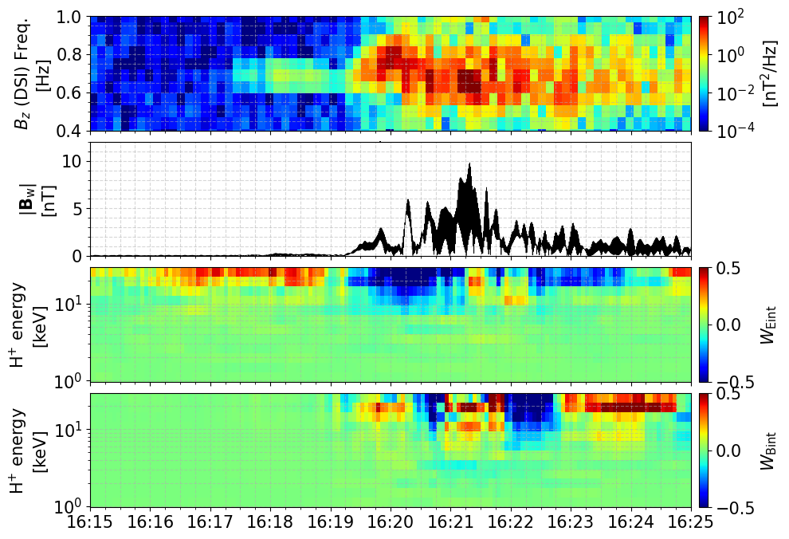
  <figcaption>図17. Shoji et al. (2021)のFigure 3の再現 (0.45 Hz~0.75 Hz)。W_Bintの16:20付近の結果を除けば、概ね結果は同じ。</figcaption>
</figure>
<figure align="center">
  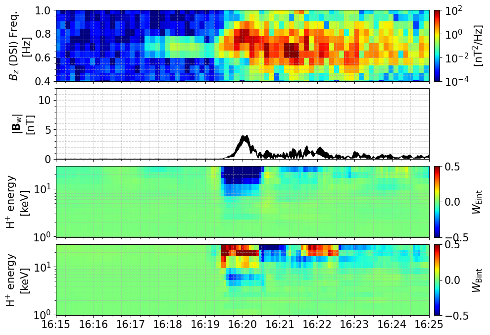
  <figcaption>図18. Shoji et al. (2021)のFigure 3の再現 (0.75 Hz~1.00 Hz)。こちらは概ね一致している。</figcaption>
</figure>


## 文責
- **作成者**: 齋藤 幸碩 ([Researchmap](https://researchmap.jp/koseki_saito))
- **最終更新日**: 2026/03/23
- **所属・役職**: 東北大学大学院理学研究科地球物理学専攻　特任研究員

## 謝辞
本書は、科学研究費助成事業 基盤研究(S) 23H05429『惑星放射線帯消失モデルの実証と能動的制御方法の開拓』の一環として作成された。作成にあたっては、東北大学大学院理学研究科地球物理学専攻の加藤雄人教授、ならびに名古屋大学大学院工学研究科電気工学専攻の竹内亘平様より、多くの議論と貴重なコメントをいただいた。ここに記して感謝申し上げる。


[^1]: Shoji, M., Y. Miyoshi, L. M. Kistler, K. Asamura, A. Matsuoka, Y. Kasaba, S. Matsuda, Y. Kasahara, and I. Shinohara (2021), ``Discovery of proton hill in the phase space duiring interactions between ions and electromagnetic ion cyclotron waves'', *Scientific Reports **11***, 13480, doi:[10.1038/s41598-021-92541-0](https://doi.org/10.1038/s41598-021-92541-0).
[^2]: Fukuhara, H., H. Kojima, Y. Ueda, Y. Omura, Y. Katoh, and H. Yamakawa (2009), ``A new instrument for th study of wave-particle interactions in space: One-chip Wave-Particle Interaction Analyzer'', *Earth, Planets and Space **61***(6), 765‒778, doi:[10.1186/BF03353183](https://doi.org/10.1186/BF03353183).
[^3]: Katoh, Y., M. Kitahara, H. Kojima, Y. Omura, S. Kasahara, M. Hirahara, Y. Miyoshi, K. Seki, K. Asamura, T. Takashima, and T. Ono (2013), ``Significance of Wave-Particle Interaction Analyzer for direct measurements of nonlinear wave-particle interactions'', *Annales Geophysicae **31***(3), 503‒512, doi:[10.5194/angeo-31-503-2013](https://doi.org/10.5194/angeo-31-503-2013).
[^4]: Shoji, M., Y. Miyoshi, Y. Katoh, K. Keika, V. Angelopoulos, S. Kasahara, K. Asamura, S. Nakamura, and Y. Omura (2017), ``Ion hole formation and nonlinear generation of electromagnetic ion cyclotron waves: THEMIS observations'', *Geophysical Research Letters **44***(17), 8,730‒8,738, doi:[10.1002/2017GL074254](https://doi.org/10.1002/2017GL074254).
[^5]: ERG Science Center, ``ErgSat/Lepi'', https://ergsc.isee.nagoya-u.ac.jp/mw/index.php/ErgSat/Lepi, Accessed 2026-03-18.
[^6]: Asamura, K., Y. Kazama, S. Yokota, S. Kasahara, and Y. Miyoshi (2018), ``Low-energy particle experiments‒ion mass analyzer (LEPi) onboard the ERG (Arase) satellite'', *Earth, Planets and Space **70***, 70, doi:[10.1186/s40623-018-0846-0](https://doi.org/10.1186/s40623-018-0846-0).
[^7]: Katoh, Y., H. Kojima, M. Hikishima, T. Takashima, K. Asamura, Y. Miyoshi, Y. Kasahara, T. Mitani, N. Higashio, A. Matsuoka, M. Ozaki, S. Yagitani, S. Yokota, S. Matsuda, M. Kitahara, and I. Shinohara (2018), ``Software-type Wave‒Particle Interaction Analyzer on board the Arase satellite'', *Earth, Planets and Space **70***, 4, doi:[10.1186/s40623-017-0771-7](https://doi.org/10.1186/s40623-017-0771-7).
[^8]: ERG Science Center (2020), ``Definition of science coordinate systems for the Arase satellite'', https://ergsc.isee.nagoya-u.ac.jp/assets/howto/ERG_Coordinate_System_202004.pdf, Accessed 2026-03-18.
[^9]: PySPEDAS Documentation, ``Arase (ERG) Analysis Tools'', https://pyspedas.readthedocs.io/en/latest/erg_analysis.html, Accessed 2026-03-18
[^10]: PySPEDAS Documentation, ``Arase (ERG)'', https://pyspedas.readthedocs.io/en/latest/erg.html, Accessed 2026-03-18
[^11]: Matsuoka, A., M. Teramoto, R. Nomura, M. Nosé, A. Fujimoto, Y. Tanaka, M. Shinohara, T. Nagatsuma, K. Shiokawa, Y. Obana, Y. Miyoshi, M. Mita, T. Takashima, and I. Shinohara (2018), ``The ARASE (ERG) magnetic field investigation'', *Earth, Planets and Space **70***, 43, doi:[10.1186/s40623-018-0800-1](https://doi.org/10.1186/s40623-018-0800-1).
[^12]: ERG Science Center, ``ErgSat/Mgf'', https://ergsc.isee.nagoya-u.ac.jp/mw/index.php/ErgSat/Mgf, Accessed 2026-03-18.
[^13]: Numpy, ``numpy.arctan2'', Version 2.4, https://numpy.org/doc/stable/reference/generated/numpy.arctan2.html, Accessed 2026-03-18.
[^14]: Kasahara, Y., Y. Kasaba, H. Kojima, S. Yagitani, K. Ishisaka, A. Kumamoto, F. Tsuchiya, M. Ozaki, S. Matsuda, T. Imachi, Y. Miyoshi, M. Hikishima, Y. Katoh, M. Ota, M. Shoji, A. Matsuoka, and I. Shinohara (2018), ``The Plasma Wave Experiment (PWE) on board the Arase (ERG) satellite'', *Earth, Planets and Space **70***, 86, doi:[10.1186/s40623-018-0842-4](https://doi.org/10.1186/s40623-018-0842-4).
[^15]: Kasaba, Y., K. Ishisaka, Y. Kasahara, T. Imachi, S. Yagitani, H. Kojima, S. Matsuda, S. Kurita, T. Hori, A. Shinbori, M. Teramoto, Y. Miyoshi, T. Nakagawa, N. Takahashi, Y. Nishimura, A. Matsuoka, A. Kumamoto, F. Tsuchiya, and R. Nomura (2017), ``Wire Probe Antenna (WPT) and Electric Field Detector (EFD) of Plasma Wave Experiment (PWE) aboard the Arase satellite: specifications and initial evaluation results'', *Earth, Planets and Space **69***, 174, doi:[10.1186/s40623-017-0760-x](https://doi.org/10.1186/s40623-017-0760-x).
[^16]: ERG Science Center, ``ErgSat/Pwe/Efd'', https://ergsc.isee.nagoya-u.ac.jp/mw/index.php/ErgSat/Pwe/Efd, Accessed 2026-03-20.


<!--
- Takeuchi, K., Y. Miyoshi, K. Asamura, K. Terasawa, C.-W. Jun, Y. Kasahara, Y. Kasaba, S. Matsuda, F. Tsuchiya, A. Kumamoto, T. Hori, A. Shinbori, A. Matsuoka, M. Teramoto, K. Yamamoto, I. Shinohara, and N. Kitamura (2025), ``Direct Measurement of Pitch Angle Scattering in EMIC-Proton Interactions by the WPIA method'', *Japan Geoscience Union Meeting 2025*, PEM13-P16.
-->